# LinDon Harris - Personal Activity System Map
## Entrepreneurial Competitive Advantage Analysis

*Created: September 17, 2025*
*Purpose: Identify entrepreneurial opportunities deeply reinforced by unique capabilities and positioning*

---

## Core Strategic Positioning

### 🎯 CENTER: "The Athletic Technician"
**Unique Value Proposition**: Elite athlete's discipline + Wall Street technician's rigor + servant leader's empathy applied to solving inefficiencies in transforming markets

---

## Primary Activity Nodes & Reinforcement Loops

### 🏆 Division I Athletic Foundation
**The Competitive Edge Loop**
```
D1 Football Experience (Columbia)
    ↓ enables
"Zero-Zero" Daily Philosophy
    ↓ drives
Extreme Work Ethic & Resilience
    ↓ powers
Steep Learning Curve Mastery
    ↓ creates
Differentiated Track Record
    ↓ attracts
Elite Opportunities (HBS, Arctos)
    ↓ reinforces
Competitive Intensity
```

### 💰 Structured Finance Expertise
**The Technical Mastery Loop**
```
$21B Morgan Stanley Transactions
    ↓ developed
Deep Credit Risk Understanding
    ↓ enabled
$60M EV Portfolio Framework (Inspiration)
    ↓ demonstrated
Risk Management Innovation
    ↓ attracts
Complex Deal Flow
    ↓ builds
Pattern Recognition in Inefficiencies
    ↓ identifies
New Market Opportunities
```

### 🏟️ Sports Investment Specialization
**The Access & Insight Loop**
```
Arctos Partners Experience ($230M deployed)
    ↓ created
Sports Industry Network
    ↓ combined with
Athlete Background
    ↓ generates
Unique Credibility with Athletes/Owners
    ↓ enables
Proprietary Deal Flow
    ↓ strengthens
Sports Finance Expertise
    ↓ opens
Emerging Sports Opportunities (Women's leagues)
```

### 🤝 High EQ Leadership
**The Trust & Influence Loop**
```
99th Percentile Interpersonal Effectiveness
    ↓ enables
Deep Stakeholder Trust
    ↓ facilitates
Board Appointments (Sidwell, Make A Play)
    ↓ expands
Elite Network Access
    ↓ generates
Partnership Opportunities
    ↓ requires
Servant Leadership Approach
    ↓ deepens
Authentic Relationships
```

### 🎓 Elite Education Platform
**The Credentialing Loop**
```
HBS MBA (Turned down Wharton/CBS full rides)
    ↓ signals
Exceptional Capability
    ↓ plus
CFA Level II Progress
    ↓ demonstrates
Technical Commitment
    ↓ combined with
Columbia Network
    ↓ creates
Multi-Tier Alumni Access
    ↓ enables
Cross-Industry Opportunities
```

### 🌍 First-Generation Professional Identity
**The Motivation & Mission Loop**
```
Caribbean Immigrant Parents
    ↓ instilled
Deep Work Ethic
    ↓ plus
2008 Family Crisis Experience
    ↓ created
Market Psychology Understanding
    ↓ drives
Mission to Democratize Finance
    ↓ motivates
"Pay It Forward" Philosophy
    ↓ builds
Authentic Leadership Brand
    ↓ attracts
Mission-Aligned Partners
```

---

## 🔴 Unique Reinforcement Patterns

### The "Inefficiency Hunter" System
```
Structured Credit Background → Identifies Pricing Anomalies
    +
Sports Industry Expertise → Sees Emerging Market Gaps
    +
High EQ → Builds Trust for Complex Negotiations
    +
Athletic Discipline → Executes with Excellence
    =
UNIQUE ABILITY TO IDENTIFY AND CAPITALIZE ON MARKET TRANSFORMATIONS
```

### The "Bridge Builder" System
```
Elite Finance Training → Speaks Institutional Language
    +
Athlete Background → Relates to Talent/Operators
    +
First-Gen Story → Authentic Connection to Underserved
    +
Servant Leadership → Creates Win-Win Structures
    =
RARE ABILITY TO BRIDGE DIFFERENT WORLDS
```

### The "Learning Machine" System
```
Athletic Mental Toughness → Embraces Discomfort
    +
96th Percentile Quantitative Analysis → Rapid Pattern Recognition
    +
Proven Track Record (MS→Arctos→Inspiration) → Confidence in New Domains
    +
CFA/Technical Study → Continuous Skill Building
    =
EXCEPTIONAL ABILITY TO MASTER NEW INDUSTRIES QUICKLY
```

---

## 💡 Entrepreneurial Thesis Opportunities

Based on your activity system, here are venture opportunities with maximum reinforcement:

### 1. 🎯 **"Athlete Capital Partners"**
**Thesis**: Platform democratizing wealth management and alternative investments for professional athletes

**Why You Win**:
- Arctos gives you credibility and deal flow
- Athlete background provides authentic connection
- Structured finance expertise enables innovative products
- High EQ builds trust with sensitive wealth discussions
- HBS network provides institutional backing

**Reinforcement**: Every athlete you help becomes advocate → more athletes → better deals → stronger platform

### 2. ⚡ **"Transition Finance"**
**Thesis**: Structured financing platform for energy transition (EV fleets, charging infrastructure, clean energy assets)

**Why You Win**:
- Inspiration Mobility gave you direct operating experience
- $60M portfolio proves execution ability
- Morgan Stanley training enables institutional-grade structuring
- Timing with climate momentum perfect
- Can bridge traditional finance with climate tech

**Reinforcement**: Each deal creates data → better risk models → lower cost of capital → more competitive → more deals

### 3. 🏟️ **"Emerging Sports Ventures"**
**Thesis**: Investment platform focused on women's sports and international leagues

**Why You Win**:
- Already researched at family office
- Arctos network provides co-investment partners
- Early mover in undervalued market
- Athlete background adds credibility
- Can structure creative financing vs. pure equity

**Reinforcement**: Success in one league → credibility → access to other leagues → portfolio effects → exit to larger PE

### 4. 💰 **"Efficient Market Labs"**
**Thesis**: Quantitative investment firm using AI/ML to identify and exploit market inefficiencies

**Why You Win**:
- Pattern recognition from $21B structured products
- 96th percentile quantitative skills
- CFA rigor for systematic approach
- Access to alternative data through sports/RE networks
- HBS provides technical co-founders

**Reinforcement**: Better models → superior returns → AUM growth → more data → better models

### 5. 🌉 **"Bridge Capital"**
**Thesis**: Investment bank/advisor for diverse and first-generation entrepreneurs accessing institutional capital

**Why You Win**:
- You ARE the customer - deep empathy
- Elite finance training to "translate"
- Proven ability to build trust across cultures
- Mission-driven attracts top talent
- Can innovate on traditional banking model

**Reinforcement**: Each success story → more credibility → both entrepreneurs and institutions seek you out → market maker position

---

## 🚀 Strategic Recommendations

### Immediate Actions (While at HBS)
1. **Build Technical Team**: Find technical co-founder in MIT/Harvard ecosystem
2. **Validate Thesis**: Use HBS resources to research market sizes
3. **Secure Advisors**: Lock in 2-3 industry legends as advisors
4. **Create Content**: Build thought leadership in chosen domain
5. **Angel Invest**: Make 5-10 small investments to build track record

### Leverage Unique Assets
- **Arctos Network**: Keep warm for co-investment and LP capital
- **Morgan Stanley Colleagues**: Source institutional funding
- **Athlete Connections**: Create proprietary deal flow
- **Board Positions**: Use for credibility and pilot customers
- **HBS Brand**: Maximum leverage in years 1-3 post-graduation

### Mitigate Gaps
- **Technical Skills**: Partner vs. build (you're the business athlete)
- **Operating Experience**: Your Inspiration role helps, but consider EIR role
- **Geographic Reach**: Strong East Coast, need West Coast presence

---

## 🎯 The Meta-Insight

Your activity system reveals someone uniquely positioned to **bridge traditionally separate worlds** - you're equally comfortable in:
- Wall Street boardrooms and locker rooms
- Structured credit and venture innovation
- Elite institutions and first-generation struggles
- Technical analysis and emotional intelligence

**Your entrepreneurial superpower isn't just any one skill - it's your ability to be a "multilingual" translator across different tribes that rarely communicate effectively.**

The ventures most likely to succeed will be those that require this bridge-building capability, where your unique positioning becomes a moat competitors cannot replicate.

## 🔄 Activity System Visual Map

```mermaid
graph TB
    %% Core Positioning
    CENTER["🎯 The Athletic Technician<br/>Elite Discipline + Technical Rigor + High EQ"]

    %% Primary Activity Nodes
    D1["🏈 D1 Athletics<br/>Columbia Football"]
    MS["💰 Morgan Stanley<br/>$21B Structured Finance"]
    ARCTOS["🏟️ Arctos Partners<br/>Sports PE Expert"]
    HBS["🎓 HBS MBA<br/>Elite Network"]
    EQ["🤝 99th %ile EQ<br/>Servant Leadership"]
    FIRSTGEN["🌍 First-Gen Professional<br/>Mission-Driven"]

    %% Supporting Activities
    ZERO["Zero-Zero Philosophy<br/>Daily Discipline"]
    RISK["Credit Risk Mastery<br/>Pattern Recognition"]
    NETWORK["Sports Industry Network<br/>Proprietary Access"]
    BOARDS["Board Positions<br/>Sidwell, Make A Play"]
    CFA["CFA Level II<br/>Technical Excellence"]
    CRISIS["2008 Crisis Experience<br/>Market Psychology"]

    %% Core Connections
    CENTER -.->|enables| D1
    CENTER -.->|enables| MS
    CENTER -.->|enables| ARCTOS
    CENTER -.->|enables| HBS
    CENTER -.->|enables| EQ
    CENTER -.->|enables| FIRSTGEN

    %% Reinforcement Loops
    D1 -->|creates| ZERO
    ZERO -->|drives| ARCTOS
    ARCTOS -->|builds| NETWORK
    NETWORK -->|attracts| HBS

    MS -->|develops| RISK
    RISK -->|enables| ARCTOS

    EQ -->|facilitates| BOARDS
    BOARDS -->|expands| NETWORK

    FIRSTGEN -->|creates| CRISIS
    CRISIS -->|deepens| RISK

    HBS -->|signals| CFA
    CFA -->|strengthens| MS

    %% Style
    classDef core fill:#f9f,stroke:#333,stroke-width:4px
    classDef primary fill:#bbf,stroke:#333,stroke-width:2px
    classDef support fill:#ddd,stroke:#333,stroke-width:1px

    class CENTER core
    class D1,MS,ARCTOS,HBS,EQ,FIRSTGEN primary
    class ZERO,RISK,NETWORK,BOARDS,CFA,CRISIS support
```



---

## 📊 Success Metrics for Venture Selection

Rate each opportunity 1-10:
1. **Leverages Sports Network?**
2. **Uses Structured Finance Skills?**
3. **Benefits from High EQ?**
4. **Addresses Market Inefficiency?**
5. **Has Mission Alignment?**
6. **Athletic Discipline Matters?**
7. **Benefits from HBS Network?**
8. **Timing with Market Trends?**
9. **Defensible Moat?**
10. **Scales Your Impact?**

**Minimum Viable Score: 70/100**

### Venture Scoring Matrix

| Venture | Sports | Finance | EQ | Inefficiency | Mission | Discipline | HBS | Timing | Moat | Impact | **Total** |
|---------|--------|---------|----|--------------|---------|-----------|----|--------|------|--------|----------|
| **Athlete Capital** | 10 | 9 | 10 | 8 | 9 | 10 | 8 | 9 | 9 | 8 | **90/100** |
| **Transition Finance** | 3 | 10 | 7 | 9 | 8 | 8 | 7 | 10 | 7 | 9 | **78/100** |
| **Emerging Sports** | 10 | 8 | 8 | 10 | 7 | 7 | 8 | 10 | 8 | 7 | **83/100** |
| **Efficient Market Labs** | 4 | 10 | 5 | 10 | 6 | 9 | 9 | 8 | 8 | 7 | **76/100** |
| **Bridge Capital** | 6 | 9 | 10 | 8 | 10 | 8 | 9 | 8 | 7 | 10 | **85/100** |

**Top Recommendation: Athlete Capital Partners (90/100)**
- Maximally leverages your unique positioning
- Addresses clear market inefficiency
- Strong mission alignment with helping athletes
- Deep moat from authentic athlete connection + finance expertise

---

*This activity system map reveals that LinDon Harris is optimally positioned for ventures that require bridging institutional finance with emerging markets, particularly where trust, technical excellence, and cultural translation create competitive advantage.*