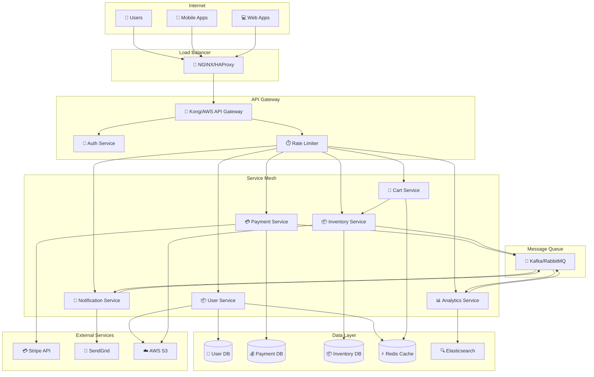
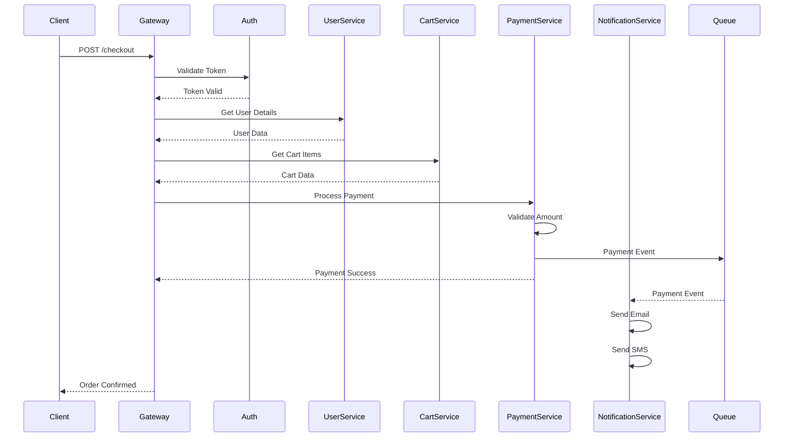

# Microservices Architecture

## System Overview

```mermaid
flowchart TB
    subgraph Internet
        Users[👥 Users]
        Mobile[📱 Mobile Apps]
        Web[💻 Web Apps]
    end
    
    subgraph "Load Balancer"
        LB[🔄 NGINX/HAProxy]
    end
    
    subgraph "API Gateway"
        Gateway[🚪 Kong/AWS API Gateway]
        Auth[🔐 Auth Service]
        RateLimit[⏱️ Rate Limiter]
    end
    
    subgraph "Service Mesh"
        Service1[📦 User Service]
        Service2[💳 Payment Service]
        Service3[📧 Notification Service]
        Service4[📊 Analytics Service]
        Service5[🛒 Cart Service]
        Service6[📦 Inventory Service]
    end
    
    subgraph "Message Queue"
        Kafka[📨 Kafka/RabbitMQ]
    end
    
    subgraph "Data Layer"
        UserDB[(👤 User DB)]
        PaymentDB[(💰 Payment DB)]
        InventoryDB[(📦 Inventory DB)]
        Cache[(⚡ Redis Cache)]
        Search[🔍 Elasticsearch]
    end
    
    subgraph "External Services"
        Stripe[💳 Stripe API]
        SendGrid[📧 SendGrid]
        S3[☁️ AWS S3]
    end
    
    Users --> LB
    Mobile --> LB
    Web --> LB
    
    LB --> Gateway
    Gateway --> Auth
    Gateway --> RateLimit
    
    RateLimit --> Service1
    RateLimit --> Service2
    RateLimit --> Service3
    RateLimit --> Service4
    RateLimit --> Service5
    RateLimit --> Service6
    
    Service1 --> UserDB
    Service1 --> Cache
    
    Service2 --> PaymentDB
    Service2 --> Stripe
    Service2 --> Kafka
    
    Service3 --> Kafka
    Service3 --> SendGrid
    
    Service4 --> Search
    Service4 --> Kafka
    
    Service5 --> Cache
    Service5 --> Service6
    
    Service6 --> InventoryDB
    Service6 --> Kafka
    
    Kafka --> Service3
    Kafka --> Service4
    
    Service1 --> S3
    Service6 --> S3
```

## Service Communication Pattern

```mermaid
sequenceDiagram
    participant Client
    participant Gateway
    participant Auth
    participant UserService
    participant CartService
    participant PaymentService
    participant NotificationService
    participant Queue
    
    Client->>Gateway: POST /checkout
    Gateway->>Auth: Validate Token
    Auth-->>Gateway: Token Valid
    
    Gateway->>UserService: Get User Details
    UserService-->>Gateway: User Data
    
    Gateway->>CartService: Get Cart Items
    CartService-->>Gateway: Cart Data
    
    Gateway->>PaymentService: Process Payment
    PaymentService->>PaymentService: Validate Amount
    PaymentService->>Queue: Payment Event
    PaymentService-->>Gateway: Payment Success
    
    Queue-->>NotificationService: Payment Event
    NotificationService->>NotificationService: Send Email
    NotificationService->>NotificationService: Send SMS
    
    Gateway-->>Client: Order Confirmed
```

## Deployment Pipeline

```mermaid
flowchart LR
    Dev[👨‍💻 Developer] --> Git{Git Push}
    Git --> CI[🔧 CI Pipeline]
    
    CI --> Tests[🧪 Unit Tests]
    Tests --> Build[📦 Docker Build]
    Build --> Scan[🔒 Security Scan]
    Scan --> Registry[🗄️ Container Registry]
    
    Registry --> CD[🚀 CD Pipeline]
    
    CD --> Dev_Env[🔵 Development]
    Dev_Env --> Test_Env[🟡 Testing]
    Test_Env --> Stage_Env[🟠 Staging]
    Stage_Env --> Approval{Manual Approval}
    Approval -->|Approved| Prod_Env[🔴 Production]
    Approval -->|Rejected| Rollback[↩️ Rollback]
    
    Prod_Env --> Monitor[📊 Monitoring]
    Monitor --> Alerts[🚨 Alerts]
```