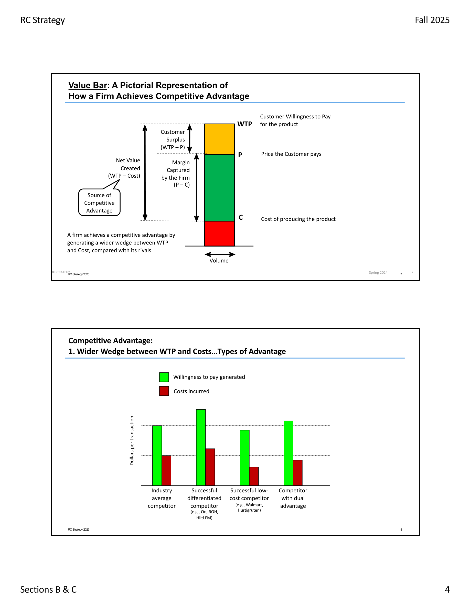
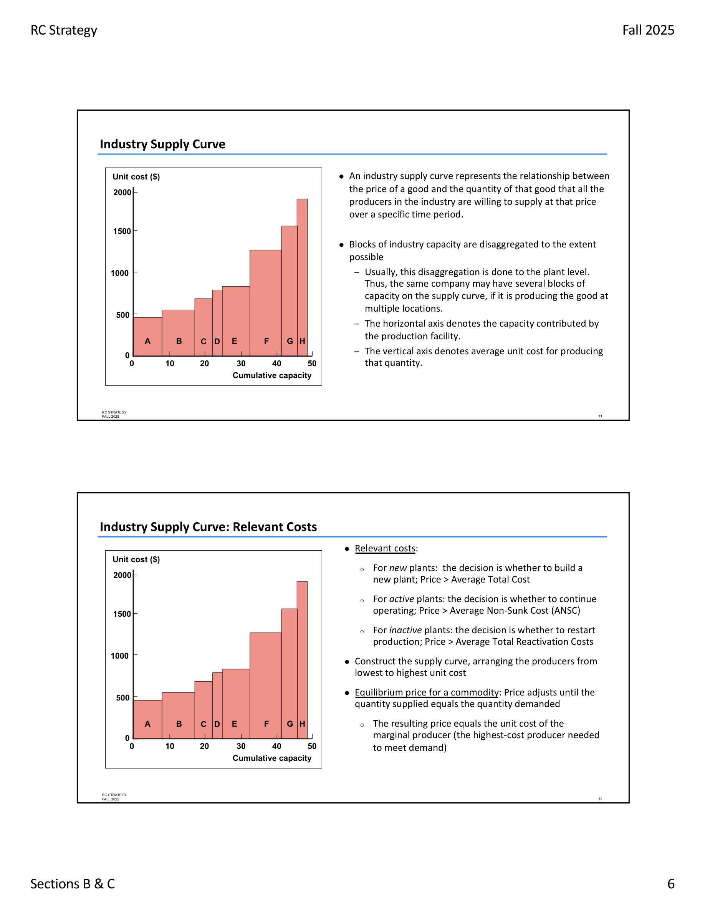
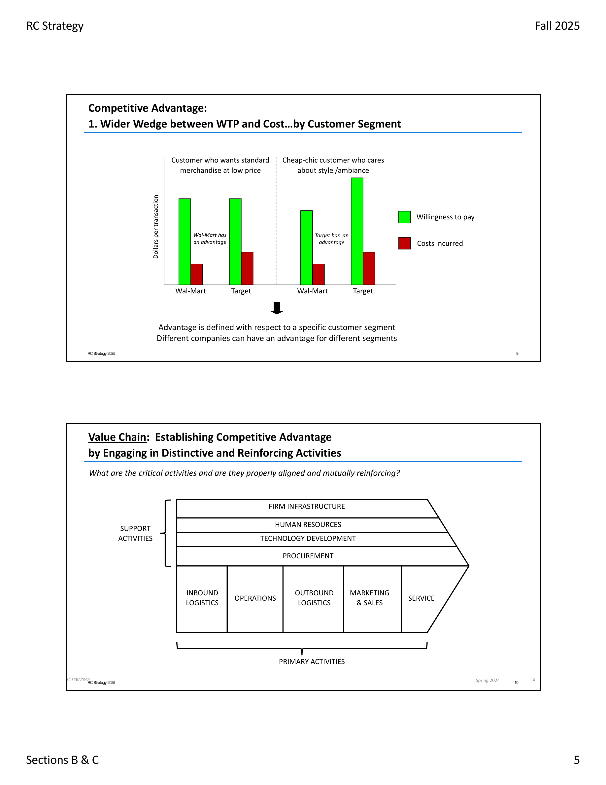
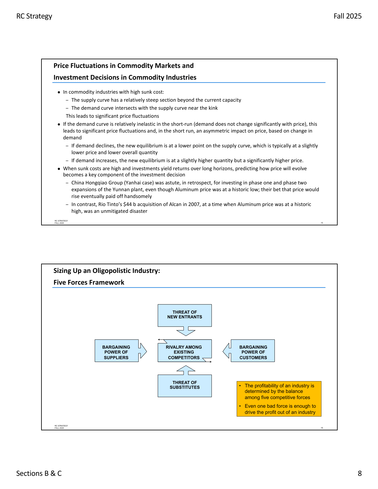
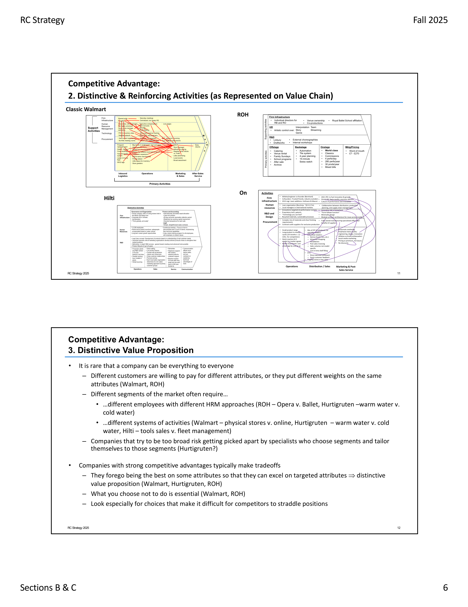
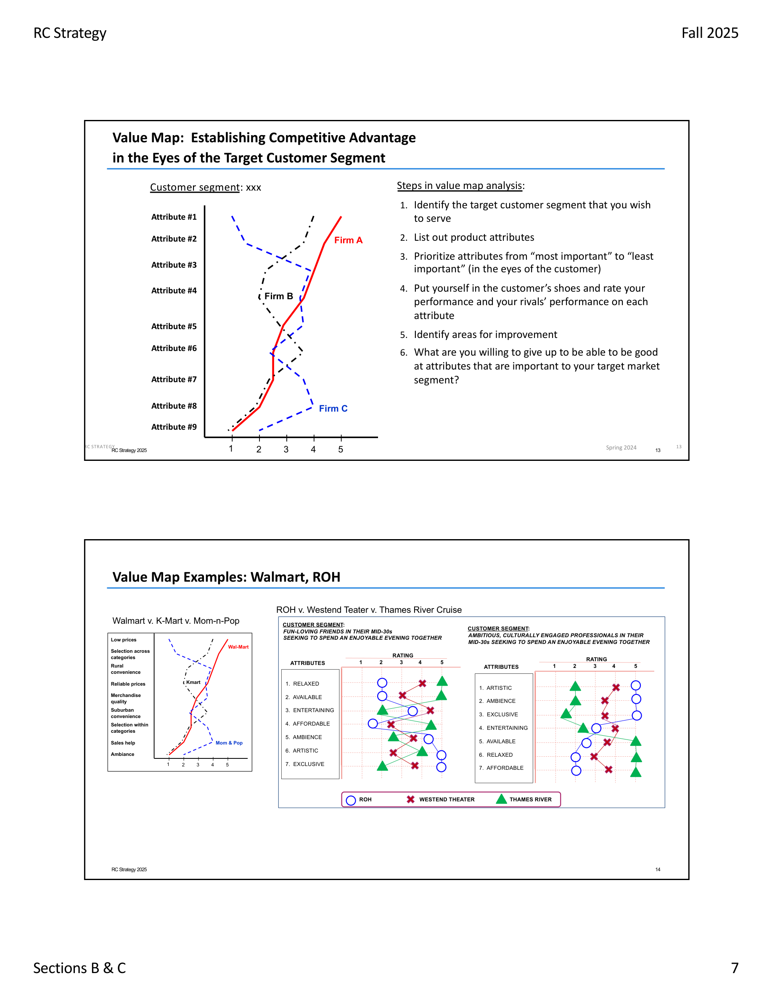
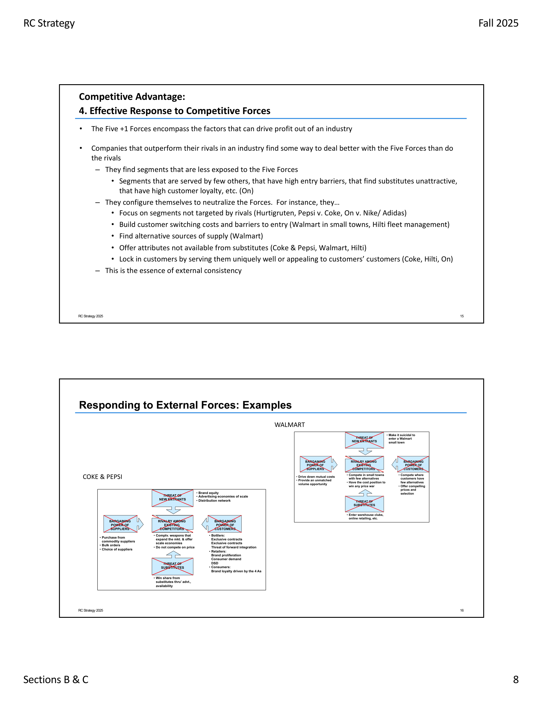
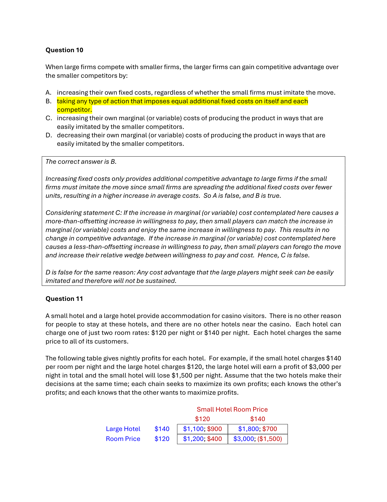
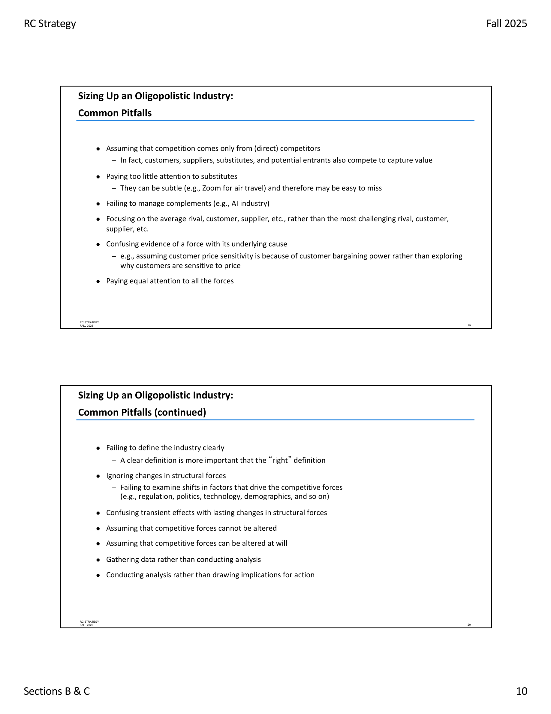

# STRAT Midterm 1 Exam Companion
*Open-Book Reference for Quiz 1 - Modules 1-3*

> **Exam Date**: Wednesday, October 15, 2025, 1:30-2:30pm
> **Format**: Canvas, Multiple Choice, Open Book/Notes
> **Coverage**: Modules 1-3
> **Professor**: Ashish Nanda, Section C
> **Last Updated**: October 15, 2025

---

## 📑 **COMPLETE TABLE OF CONTENTS**

**I. EXAM ESSENTIALS** (Lines 1-110)
- [Exam Quick Facts](#exam-quick-facts) (Line 20)
- [Pre-Exam Quick Review](#pre-exam-quick-review) (Line 45)
- [Key Formulas & Equations](#key-formulas--equations) (Line 58)
- [During Exam: Question Type Quick Reference](#during-exam-question-type-quick-reference) (Line 118)

**II. PRACTICE QUESTION GUIDANCE** (Lines 151-280)
- [Practice Question Patterns & Pitfalls](#practice-question-patterns--pitfalls) (Line 151)
  - 8 Common Question Types (Lines 155-250)
  - Key Pitfalls to Avoid (Lines 260-278)

**III. CORE STRATEGIC FRAMEWORKS** (Lines 290-690)
- [1. Competitive Advantage Fundamentals](#1-competitive-advantage-fundamentals) (Line 292)
  - Value Bar & Central Equation (Line 295) 📊 **VISUAL NEEDED**
  - Three Strategic Paths (Line 304)
  - Segment-Specific Advantage (Line 309)
  - Four Patterns Framework (Line 333)
- [2. Analytical Tools Arsenal](#2-analytical-tools-arsenal) (Line 344)
  - Five Forces + Complements (Line 346) 📊 **VISUAL NEEDED**
  - Buyer & Supplier Power (Line 400)
  - Good Habits for Five Forces (Line 438)
  - Value Chain Analysis (Line 461) 📊 **VISUAL NEEDED**
  - Activity System Mapping (Line 467)
  - WTP Estimation (B2B Method) (Line 473)
  - Value Maps (Line 500)
- [3. Game Theory & Strategic Interaction](#3-game-theory--strategic-interaction) (Line 516)
  - 4-Step Process (Line 518)
  - Nash Equilibrium (Line 524)
  - Retaliation vs Accommodation (Line 535) 📊 **VISUAL NEEDED**
- [4. Judo vs Sumo Strategies](#4-judo-vs-sumo-strategies) (Line 582)
- [5. Scale and Fixed Cost Advantage](#5-scale-and-fixed-cost-advantage) (Line 605)
- [6. Entry Timing & Strategic Windows](#6-entry-timing--strategic-windows) (Line 631)
- [7. Rivalry Intensity Factors](#7-rivalry-intensity-factors) (Line 664)

**IV. CASE REPOSITORY** (Lines 692-932)
- [Module 1: Foundations](#module-1-foundations-of-strategy) (Line 694)
  - On (A) - Premium Differentiation (Line 696)
  - Yanhai Aluminum - Cost Leadership (Line 721)
- [Module 2: Competitive Dynamics](#module-2-competitive-dynamics) (Line 747)
  - Cola Wars (Line 749)
  - AI Wars 2025 (Line 771)
  - Walmart USA (Line 792) 📊 **VISUAL: Activity System**
  - Royal Opera House (Line 815)
- [Module 3: Competitive Strategy](#module-3-competitive-strategy--positioning) (Line 859)
  - Ryanair (Line 861)
  - Hilti (Line 886)

**V. CROSS-CASE PATTERNS & TOOLS** (Lines 934-1090)
- [Cross-Case Patterns](#cross-case-patterns--insights) (Line 934)
- [Case Index (Ctrl+F)](#case-index-ctrlf-these-names) (Line 986)
- [Likely Question Patterns](#likely-question-patterns) (Line 1004)
- [Framework Selection Guide](#framework-selection-guide) (Line 1056)
- [Strategic Vocabulary](#strategic-vocabulary---quick-definitions) (Line 1071)

**VI. MARGINAL POINTS & EXAM STRATEGY** (Lines 1091-1242)
- [Marginal Points - Edge Cases](#marginal-points---edge-cases--subtle-distinctions) (Line 1091)
- [Exam Strategy Tips](#exam-strategy-tips) (Line 1166)
- [Final Pre-Exam Checklist](#final-pre-exam-checklist) (Line 1198)
- [Core Principles - Memorize These](#core-principles---memorize-these) (Line 1217)

---

## ⚡ EXAM QUICK FACTS

**TIMING & FORMAT**
- **Duration**: 1 hour (1:30-2:30pm)
- **Location**: Regular classroom section
- **Platform**: Canvas (https://canvas.hbs.edu/)
- **Type**: Multiple Choice
- **Weight**: 10% of total grade

**WHAT YOU CAN BRING**
- ✅ Written notes
- ✅ Device documents (cases, module notes)
- ✅ This guide (open on device or printed)

**INTERNET USAGE**
- ✅ **ALLOWED**: Canvas, HBS OneDrive, Quiz corrections (http://bit.ly/42hVBOZ)
- ❌ **PROHIBITED**: Email, Chat, Slack, **Generative AI tools (ChatGPT)**

**SUPPORT**
- Content questions: stratexam2025@hbs.edu
- Tech issues: 617-495-6600 (option 1)
- Corrections: Posted on classroom board / http://bit.ly/42hVBOZ

---

## 🧮 KEY FORMULAS & EQUATIONS

📊 **VISUAL EXHIBIT 1: Value Bar Diagram**
*See: resources/Module II Summary.pdf (Page 4, Slide 7)*



**Competitive Advantage**
```
CA = (WTP - Cost)YOU > (WTP - Cost)COMPETITORS
```

**Added Value**
```
Added Value = Value with firm - Value without firm
```

**Value Creation vs Capture**
```
Value Created ≠ Value Captured
Customer gets: WTP - Price (Consumer Surplus)
Firm gets: Price - Cost (Margin)
Supplier gets: Cost - WC (Willingness to Supply)
```

**Profit Variation Sources**
- Industry effects: 5-15% of profit variation
- Within-industry effects: 30-45% of profit variation
- Firm-specific effects matter MOST

---

### MODULE I: Cost Concepts & Decision Rules

📊 **VISUAL EXHIBIT 2: Supply Curve Diagrams**
*See: resources/Module I Summary.pdf (Page 6, Slide 11-12)*



| Cost Type | Definition | Decision Context | Decision Rule |
|-----------|-----------|------------------|---------------|
| **Marginal Cost** | Cost of producing one additional unit | Change in output | Increase output if: **Price > MC** |
| **Non-Sunk Cost (NSC)** | Costs eliminated if plant shut down | Exiting existing capacity | Continue operations if: **Price > Avg NSC** |
| **Total Cost** | NSC + Sunk costs (incl. capital charges) | Entry/new capacity | Enter/invest if: **Price > Avg Total Cost** |

**Supply Curve Quick Facts**:
- **Flat supply curve** → Low profitability (easy tech imitation, common processes)
- **Steep supply curve** → High profitability for efficient producers (proprietary tech, hard to imitate)
- **Equilibrium price** = Unit cost of **marginal producer** (highest-cost producer needed to meet demand)

**Price Fluctuations in Commodity Markets** (ASYMMETRIC!):

**When demand INCREASES** (inelastic demand):
- Quantity: Slightly higher
- Price: **MUCH higher** (exponential increase!)
- **Why**: Supply curve steep beyond capacity, can't add capacity quickly

**When demand DECREASES** (inelastic demand):
- Quantity: Slightly lower
- Price: Slightly lower (modest decrease)
- **Why**: Existing producers keep operating (price > ANSC)

**Key Asymmetry**: Prices rise MUCH faster than they fall!

**Investment Timing Examples**:
- ✅ **Smart**: China Hongqiao (Yanhai) invested at aluminum price lows → Paid off handsomely
- ❌ **Disaster**: Rio Tinto's $44B Alcan acquisition at 2007 price peak → Unmitigated disaster

**Lesson**: In high-sunk-cost commodities, predicting price evolution is KEY to investment decisions

---

## 📋 DURING EXAM: Question Type Quick Reference

### If question asks "What creates competitive advantage?"
→ Search: "Competitive Advantage Fundamentals" (Ctrl+F)
→ Answer framework: WTP vs Cost wedge

### If question asks "Which framework to use?"
→ Jump to: "Framework Selection Guide" (Line 1056)
→ Match situation to framework

### If question asks about specific case
→ Use Ctrl+F: [Company name]
→ Read "Key Takeaway" bullet first
→ Check "Strategic Position" summary

### If question asks "What would Company X NOT do?"
→ Look for: "Strategic Trade-offs" in case section
→ Principle: Companies make clear choices on what NOT to do

### If question compares two cases
→ Jump to: "Cross-Case Patterns" (Line 934)
→ Look for Pattern categories

### If question involves cost decisions (operate which days? enter market?)
→ Jump to: "Cost Concepts & Decision Rules" (Line 72)
→ Remember: **Ignore sunk costs!**
→ Decision rule: Compare Total Revenue vs. Total Non-Sunk Cost

### If question asks about game theory/equilibrium
→ Jump to: "Game Theory Quick Rules" (Line 516)
→ Check each cell: Can either player improve by deviating?

---

## ⚠️ KEY PITFALLS TO AVOID (From Practice Quiz)

1. ❌ **"Perfect conditions = guaranteed profits"**
   → Even 4/5 good forces doesn't guarantee profits if 5th force is terrible

2. ❌ **"Terrible conditions = no profits possible"**
   → Even with all bad forces, positioning can create profitable pockets

3. ❌ **Missing subtle substitutes**
   → Smartphones for PCs, wearables for phones, Zoom for air travel

4. ❌ **Confusing correlation with causation**
   → PC compatibility requirements REDUCE buyer power (create lock-in), not increase it

5. ❌ **Backwards on entry barriers**
   → Higher fixed costs from 5G → HARDER to enter (barriers UP), not easier!

6. ❌ **Equilibrium ≠ Best outcome**
   → Just because both choose X doesn't mean (X,X) is an equilibrium - check deviation incentives!

7. ❌ **Ignoring customer segment size**
   → Large-volume customers typically have MORE power, not less

8. ❌ **Consolidation effects backwards**
   → Fewer, larger competitors → EASIER coordination → LESS intense rivalry

---

## 🎯 Core Strategic Frameworks

### 1. Competitive Advantage Fundamentals
*Source: Competitive Advantage - Rivkin*

#### The Central Equation
**Competitive Advantage = Wider wedge between Willingness to Pay (WTP) and Cost than competitors**

📊 **VISUAL EXHIBIT 8: Value Bar - Pictorial Representation**
*See: resources/Module II Summary.pdf (Page 4, Slide 7)*
*Shows: WTP at top, Price in middle, Cost at bottom, with Customer Surplus and Firm Margin clearly marked*


#### Key Concepts:
- **Added Value**: Value created with firm - Value created without firm
- **Value Creation vs Capture**: Creating value ≠ Capturing value
- **Industry Effects**: Only 5-15% of profit variation
- **Within-Industry Effects**: 30-45% of profit variation

#### Three Strategic Paths:
1. **Differentiation**: ↑↑ WTP with ↑ Cost
2. **Low-Cost**: ↓↓ Cost with ↓ WTP
3. **Dual Advantage**: ↑ WTP AND ↓ Cost (rare, difficult to sustain)

📊 **VISUAL EXHIBIT 9: Types of Advantage**
*See: resources/Module II Summary.pdf (Page 4, Slide 8)*
*Shows: Bar chart comparing WTP and Cost for industry average, differentiated competitor, low-cost competitor, and dual advantage competitor*


#### Segment-Specific Competitive Advantage (CRITICAL!)

**Key Principle**: Advantage is NOT universal - it varies by customer segment!

**Worked Example** (Blue Bottle vs Dunkin'):

|  | Segment 1: Urban Professionals | Segment 2: College Students | Segment 3: Commuters |
|--|-------------------------------|----------------------------|---------------------|
| **Blue Bottle** |  |  |  |
| WTP | $6.50 | $5.00 | $4.25 |
| Cost | $3.50 | $3.00 | $3.25 |
| **Wedge** | **$3.00** ✅ | $2.00 | $1.00 |
| **Dunkin'** |  |  |  |
| WTP | $3.75 | $4.50 | $3.75 |
| Cost | $2.25 | $2.00 | $2.00 |
| **Wedge** | $1.50 | **$2.50** ✅ | **$1.75** ✅ |

**Result**:
- Blue Bottle has advantage in Segment 1 ($3.00 > $1.50)
- Dunkin' has advantage in Segments 2 and 3
- **Same industry, different advantages by segment!**

📊 **VISUAL EXHIBIT 10: Segment-Specific Advantage Visual**
*See: resources/Module II Summary.pdf (Page 5, Slide 9)*
*Shows: Walmart vs Target across different customer segments*



**Exam Insight**: When comparing competitive advantage, ALWAYS ask "in which segment?" Different firms can dominate different segments profitably.

---

### Four Patterns Among Companies with Competitive Advantage

**Professor Nanda's Framework** (Module II Summary):

1. **Wider wedge between WTP and costs** → The fundamental definition
2. **Reinforcing choices throughout value chain** → Internal consistency creates sustainability
3. **Distinctive value proposition** → Clear trade-offs, not everything to everyone
4. **Effective response to competitive forces** → External consistency neutralizes threats

**Exam Pattern**: Questions asking "What creates X's advantage?" test whether you can identify ALL FOUR patterns, not just one!

---

### 2. Analytical Tools Arsenal

#### Porter's Five Forces (+ Complements) - THE SIXTH FORCE!

📊 **VISUAL EXHIBIT 11: Five Forces Diagram**
*See: resources/Module I Summary.pdf (Page 8, Slide 16)*
*Shows: Five forces in pentagon formation with "Availability of Complements" as sixth force*



- **Purpose**: Industry attractiveness & competitive dynamics
- **Forces**: Rivalry, Suppliers, Buyers, Substitutes, New Entrants, **+ COMPLEMENTS**
- **Application**: Use for industry-level analysis, not firm-specific
- **Key Insight**: Even ONE bad force can destroy industry profitability

**THE SIXTH FORCE: Complements (Often Forgotten!)**

**Definition**: Products/services that increase demand for the focal product
- Gaming consoles + video games
- PCs + software (Wintel: Windows + Intel)
- Smartphones + apps
- Coffee machines + coffee pods
- Cars + gasoline

**The Paradox**:
- ✅ **Good**: Complements expand the total market (grow the pie)
- ❌ **Bad**: Complement providers want THEIR slice of value
- If complements are scarce/powerful → They capture the value!

**Example - PC Industry**:
- **Complement**: Windows OS + Intel chips (Wintel)
- **Effect**: Made PCs valuable BUT captured most industry profits
- **PC makers**: Low margins despite growing market
- **Lesson**: Growing market ≠ Profits for you

**Exam Traps**:
- ❌ Assuming complements are always good (they expand pie but take a slice!)
- ❌ Forgetting to count complements as a competitive force
- ✅ Ask: "Who controls the complements? Do they have power?"

**How to manage complements**:
- Develop your own (Apple: hardware + software + services)
- Commoditize them (Android: open-source OS reduces complement power)
- Lock in exclusive relationships

**Common Five Forces Pitfalls** (Avoid These!):
- ❌ Competition only from direct competitors → Suppliers, buyers, substitutes also compete for value!
- ❌ Ignoring subtle substitutes → They can be indirect (Zoom for air travel, wearables for phones)
- ❌ Forgetting complements → They expand the pie but want a slice
- ❌ Focusing on average player → Focus on MOST CHALLENGING rival/customer/supplier
- ❌ Confusing evidence with cause → Why are customers price-sensitive? (Don't just assume it's buyer power)
- ❌ Equal attention to all forces → Focus on the 1-2 forces that matter most
- ❌ Ignoring changes over time → Technology, regulation, demographics shift forces

**Exam Tip**: Look for words "industry" or "profitability" → Use Five Forces

**CRITICAL PITFALL - Industry Definition**:
- **"A clear definition is more important than the 'right' definition"**
- Don't spend exam time debating boundaries
- Pick a reasonable definition and STICK WITH IT
- Consistency matters more than perfection

---

#### Buyer & Supplier Power - Subtle Traps!

**What INCREASES Buyer Power**:
- ✅ Many substitutes available (more options = more power)
- ✅ Buyers consolidate (fewer, larger buyers)
- ✅ Product is undifferentiated commodity (easy to switch)
- ✅ Buyer can credibly backward integrate (threaten to make it themselves)
- ✅ Low switching costs (easy to change suppliers)

**What DECREASES Buyer Power** (Common Exam Traps!):
- ❌ **Lock-in/Switching costs** - Customer gets trapped
  - Example: PC compatibility requirements bind customers to one vendor
- ❌ **Supplier consolidation** - Fewer suppliers = less buyer choice
  - Example: Lenovo + HP merge → customers have less negotiating power
- ❌ **Differentiation** - Unique products reduce buyer alternatives
- ❌ **High costs of switching** - Makes buyers captive

**CRITICAL EXAM TRAP**:
**"Customers want compatibility" → Does this INCREASE buyer power?**
- ❌ **WRONG**: "Yes, because they're demanding more"
- ✅ **RIGHT**: "No, because compatibility LOCKS THEM IN to one vendor"
- **Reasoning**: Switching costs increase → Buyer power DECREASES

**Volume vs Power Confusion**:
- ❌ **WRONG**: "Customer concentrates purchases → More volume → More power"
- ✅ **RIGHT**: "If total volume doesn't change, just concentrated with one supplier, buyer gets LOCKED IN → LESS power"
- **Key**: Distinguish volume increase from lock-in effect

**Supplier Power Mirrors**:
- Supplier consolidation → **Increases supplier power** (fewer options for buyers)
- More suppliers enter → **Decreases supplier power** (more competition)
- Critical input becomes scarce → **Increases supplier power**

**Exam Pattern**: Questions often test whether you confuse:
1. Lock-in (reduces buyer power) vs Volume concentration (could increase power)
2. Substitutes (increase buyer power) vs Complements (separate force)
3. Consolidation among buyers (increases their power) vs Suppliers (increases supplier power)

---

#### Good Habits for Five Forces Analysis

**Use Income Statements** to understand:
- Fixed vs marginal cost structure
- Economies of scale potential
- Major suppliers (large COGS line items)
- Cost breakdown by activity

**Build a Repertoire of Responses** to each force:
- **Strong customer power** → Build switching costs, find loyal segments, integrate downstream, discover latent needs
- **Major threat of substitutes** → Enter substitutes' markets, incorporate substitute benefits (e.g., calcium-fortified OJ vs milk)
- **Powerful suppliers** → Find alternative sources, integrate backward, form purchasing consortia

**Know Your Industry's History**:
- Pattern recognition prevents repeating mistakes
- Example: Furniture industry consolidation attempts fail every 10-20 years → tells you something fundamental about industry structure
- **Exam tip**: If case mentions past strategic failures, that's a clue about structural constraints!

**Use Analogies and Counterexamples**:
- If brands drive soft drink profits, why do branded airlines/autos/PCs struggle?
- If bottlers are weak (no brands), why do cable operators (no brands, "bottle" others' content) profit?
- **Case method power**: Gives you analogies to apply across industries

---

#### Value Chain Analysis

📊 **VISUAL EXHIBIT 12: Value Chain Diagram**
*See: resources/Module II Summary.pdf (Page 6, Slide 11)*
*Shows: Primary Activities (horizontal arrow) and Support Activities (spanning above)*



- **Primary Activities**: Inbound Logistics → Operations → Outbound Logistics → Marketing & Sales → Service
- **Support Activities**: Infrastructure, HR, Technology, Procurement
- **Key Insight**: Look for reinforcing activities (interconnections matter!)
- **Exam Tip**: Use when analyzing "how firm creates value"

---

#### Activity System Mapping

📊 **VISUAL EXHIBIT 13: Walmart Activity System Map**
*See: resources/Module II Summary.pdf (Page 7, Slide 12)*
*Shows: Hub-and-spoke diagram with "EDLP" at center, connected activities with reinforcing arrows*



- Map interconnected strategic choices
- Identify reinforcement patterns
- Spot strategic themes
- **Exam Tip**: Think "how do activities strengthen each other?"

---

#### Estimating Willingness to Pay (B2B Method)

**WTP is NOT abstract** - It can be calculated in B2B contexts!

**Step-by-Step Process**:
1. **Identify best alternative** for target customer
2. **Add all additional costs** (direct + hidden) customer incurs using alternative
3. **Subtract customer costs** (direct + hidden) of using YOUR product/service
4. **Result** = Customer's WTP for your product

**Formula**:
```
WTP = Price of Alternative + (Costs of Alternative) - (Costs of Your Solution)
```

**Example (Hilti pattern)**:
- Alternative: Buying tools outright at $X
- Hidden costs of alternative: Maintenance, theft, downtime, inventory management = $Y
- Your solution costs: Just monthly fee, no hidden costs = $Z
- **WTP** = $X + $Y - $Z

**CRITICAL CAVEAT**:
- ❌ Customers may NOT be aware of hidden costs
- If alternative's hidden costs are high, **pricing power is LIMITED** with moderately informed customers
- **Solution**: **Customer education** about hidden costs increases your pricing power!
- **Exam insight**: Questions may test whether you understand education affects realized WTP

---

#### Value Maps

📊 **VISUAL EXHIBIT 14: Value Map Examples**
*See: resources/Module II Summary.pdf (Page 8, Slide 13-14)*
*Shows: Walmart vs K-Mart positioning on Price (vertical) and Selection (horizontal) axes*



- Plot competitive positioning on key attributes
- Identify "strategic groups"
- Find white space opportunities
- **Exam Tip**: Use for comparing competitive positions

**Steps in Value Map Analysis**:
1. Identify target customer segment
2. List product attributes
3. Prioritize attributes (most to least important from CUSTOMER perspective)
4. Rate your performance vs rivals on each attribute
5. Identify improvement areas
6. **Critical**: What are you willing to GIVE UP to excel at important attributes?

**Examples**: Walmart (low price + selection vs ambiance), ROH (artistic + exclusive vs affordable + relaxed)

---

### 3. Game Theory & Strategic Interaction Quick Rules

**Game Theory 4-Step Process**:
1. **Define**: Players, choices, sequence, information
2. **Calibrate**: Calculate payoffs for all outcomes
3. **Analyze**: Find equilibrium (no one wants to deviate)
4. **Change**: How can you improve the game in your favor?

**Finding Nash Equilibrium**:
- Check EACH cell in payoff matrix
- Ask: Can Player 1 improve by changing their choice? Can Player 2?
- If NEITHER can improve → **Equilibrium found**
- If someone can improve → **Not an equilibrium**

**Dominant Strategy**:
- A choice that's best REGARDLESS of what opponent does
- If you have one → Use it!
- Check by comparing your payoffs across opponent's choices

---

#### Retaliation vs. Accommodation Decision

**When to RETALIATE** (Price aggressively):
- ✅ High fixed costs, low marginal costs (willing to drop price to keep customers)
- ✅ Elastic demand with excess capacity (small price advantage → big volume gain)
- ✅ Entrant is financially weak (goal: drive them out)
- ✅ You're "patient" (care about future, deter future entry)
- ✅ Can target retaliation (surgical strike, not market-wide)
- ✅ **Entrant shows pattern of rapid expansion in other markets** (deal with them NOW before they grow)
- ✅ Entry would encourage future entrants (signaling/deterrence value)

**When to ACCOMMODATE** (Accept entry):
- ✅ Entrant is small and expected to stay small
- ✅ You're large (small loss not worth market-wide price war)
- ✅ Cannot target retaliation (must drop all prices to keep customers)
- ✅ Retaliation would destroy more value than it saves
- ✅ Entry might expand total market (rising tide lifts boats)
- ✅ **You're focused on other strategic priorities** (e.g., BA during privatization)
- ✅ Difficult to raise prices after period of low prices (retaliation has lasting cost)

---

#### Retaliation Economics - Worked Example

📊 **VISUAL EXHIBIT 15: Retaliation Economics Calculation**
*See: resources/Quiz 1 Practice Questions Answer Key Fall 2025.pdf (Page 11-12, Questions 11-12, Ryanair context)*



**Scenario**: MetroRail (1,250 tickets/day at $295, MC=$200) faces SwiftRail entry (400 tickets at $225)

**Option 1: Maintain Price ($295)**
- Lose 250 customers to entrant
- **Loss** = 250 × ($295 - $200) = 250 × $95 = **$23,750/day**

**Option 2: Match Price ($225)**
- Keep all 1,250 customers
- **Loss** = 1,250 × ($295 - $225) = 1,250 × $70 = **$87,500/day**

**Decision**: Maintain price (smaller loss of $23,750 vs $87,500)

**Key Insight**: Large incumbents with high volumes suffer MORE from matching prices than from losing some customers. Accommodation can be rational!

**General Formula**:
- **Cost of Retaliation** = (Old Price - New Price) × Total Volume
- **Cost of Accommodation** = (Price - MC) × Lost Volume
- **Retaliate if**: Cost of Accommodation > Cost of Retaliation

**Credible Signaling** (Making threats believable):
- Must be **Visible** (competitor sees it)
- Must be **Clear** (competitor understands it)
- Must be **Irreversible** (hard to back off from)
- Example: Public press release + capacity investment

---

### 4. Judo vs Sumo Strategies (Entrant vs Incumbent)

**JUDO STRATEGY** (New Entrant Tactics):
1. **Go where rival isn't** - Attack segments/geographies incumbent ignores
   - Ryanair: Secondary airports, no-frills service
   - Keroche: Low-income fortified wines (underserved segment)
2. **Turn strength into weakness** - Make incumbent's advantages into liabilities
   - Ryanair: Aer Lingus's full-service model = high cost structure (can't match low prices)
   - Incumbent's premium brand prevents them from "going downmarket"
3. **Don't provoke unnecessarily** - Start small, don't threaten core business immediately
   - Stay below retaliation threshold
   - Let incumbent accommodate while you build strength

**SUMO STRATEGY** (Incumbent Response):
1. **Leverage scale** - Spread fixed costs, volume discounts, brand investment
2. **Use scope** - Cross-subsidize, bundle products, multi-market contact
3. **Exploit network effects** - Lock in customers through switching costs
4. **Increase fixed costs** - Force entrant to match investments they can't afford
5. **Non-market tactics** - Lobbying, regulation, standards-setting
   - EABL vs Keroche: Regulatory changes, distribution control

**Key Exam Insight**: Judo works when incumbent CAN'T respond without sacrificing existing profits. Sumo works when scale/scope advantages are sustainable.

---

### 5. Scale and Fixed Cost Competitive Advantage

**How Large Firms Use Fixed Costs as Weapons**:

**Principle**: Impose equal fixed cost increases on all competitors
- Large firm spreads cost over MORE units → smaller per-unit impact
- Small firm spreads cost over FEWER units → larger per-unit impact
- Result: Small firm's average cost rises MORE than large firm's

**Example**:
- Large firm: 1M units → $10M fixed cost increase = $10/unit impact
- Small firm: 100K units → $10M fixed cost increase = $100/unit impact

**This only works if**:
- ✅ Small firms MUST imitate the move (industry standard, competitive necessity)
- ✅ The cost is truly fixed (doesn't scale with volume)
- ❌ WON'T work if small firms can ignore the move

**Real-world applications**:
- Advertising spending (Coke/Pepsi)
- R&D investments (pharmaceuticals)
- Technology infrastructure (platforms)
- Distribution networks (consumer goods)

**Exam Trap**: Simply increasing your own fixed costs doesn't help unless competitors must match and can't spread costs as efficiently!

---

### 6. Entry Timing & Strategic Windows

**When is the RIGHT time to enter a market?**

**FAVORABLE Entry Windows**:
1. **Regulatory change** - Deregulation creates opportunities
   - Ryanair: European aviation deregulation + UK moving to open skies
2. **Incumbent distraction** - Large player focused elsewhere
   - Ryanair: BA undergoing privatization (distracted)
3. **Technology shift** - New tech changes cost structures
   - Allows entrant to build different cost base
4. **Market growth** - Rising tide reduces retaliation risk
   - Incumbents can grow without losing absolute volume
5. **Incumbent cost structure burden** - They can't match your economics
   - Legacy costs, union contracts, premium brand constraints

**UNFAVORABLE Entry Timing**:
- ❌ Mature, slow-growth market (zero-sum game)
- ❌ Incumbent just completed major efficiency drive (lean and mean)
- ❌ Excess capacity in industry (price war likely)
- ❌ Strong incumbent with no constraints (can easily retaliate)

**Entry Size Considerations**:
- **Small entry**: Less threatening, more likely accommodation
  - Risk: Stay subscale forever
- **Aggressive entry**: Grabs market share quickly
  - Risk: Provokes retaliation

**Exam Pattern**: Look for questions like "Should X enter now?" Check for:
- Is there a regulatory/technology window?
- Is incumbent distracted/constrained?
- Can entrant build sustainable cost advantage?

---

### 7. Rivalry Intensity Factors

**What makes rivalry MORE intense**:
- ✅ Many small competitors (fragmentation)
- ✅ Slow industry growth (zero-sum competition)
- ✅ High fixed costs (fight for volume to spread costs)
- ✅ Lack of differentiation (compete only on price)
- ✅ High exit barriers (can't leave even when unprofitable)
- ✅ Excess capacity (everyone fighting for utilization)

**What makes rivalry LESS intense**:
- ✅ Few large competitors (easier coordination)
- ✅ Fast industry growth (growing pie for everyone)
- ✅ Product differentiation (compete on dimensions beyond price)
- ✅ Low exit barriers (unprofitable firms can leave)
- ✅ Tight capacity (no desperation pricing)

**EXAM TRAP - Consolidation Effects**:
- **Q**: "Industry consolidates from 20 to 5 firms. Effect on rivalry?"
- ❌ **WRONG**: "More intense" (thinking oligopoly = fierce competition)
- ✅ **RIGHT**: "Less intense" (fewer firms = easier coordination + each has more to lose from price war)

**Key Insight**:
- Many small firms → Hard to coordinate, easy to undercut prices
- Few large firms → Easier to read signals, discipline each other, expensive to wage price war

---

## 📊 CASE REPOSITORY & KEY LEARNINGS

### Module 1: Foundations of Strategy

#### 🏃 On (A) - Premium Differentiation
*Case Notes: 9-723-430*

**Strategic Position**: Premium performance running shoes through innovation

**Key Success Factors**:
- CloudTec cushioning technology (proprietary)
- Direct-to-consumer + selective retail (controlled distribution)
- Community-driven marketing (brand building)

**Strategic Path**: Differentiation (Higher WTP > Higher Cost)

**Reinforcing Activities**:
- Premium tech → Premium price → Premium retail → Premium brand
- Innovation → Performance stories → Brand premium → R&D funding

**Strategic Trade-offs** (What they DON'T do):
- No discount channels
- No mass market products
- No extensive retail partnerships

**Key Takeaway**: Premium positioning requires consistent choices across ALL activities. Every decision reinforces the premium position.

---

#### 🏭 Yanhai Aluminum - Cost Leadership & Industry Dynamics
*Case Notes: N1-726-353*

📊 **VISUAL EXHIBIT 16: Aluminum Supply Curve & Price Dynamics**
*See: resources/Module I Summary.pdf (Pages 10-12, Slides 19-21)*
*Shows: Industry supply curve, marginal producer concept, price asymmetry in commodity markets*



**Strategic Position**: Low-cost producer in commodity aluminum market

**Key Success Factors**:
- Scale economies (large production capacity)
- Location advantages (near raw materials)
- Supply curve positioning (among lowest-cost producers)

**Strategic Path**: Low-Cost (Lower Cost > Lower WTP)

**Industry Dynamics**:
- Commodity market → Price taker
- Cost position determines survival
- Capacity decisions affect industry supply curve

**Strategic Trade-offs** (What they DON'T do):
- No premium products
- No brand differentiation
- No value-added services

**Key Takeaway**: In commodities, cost position is EVERYTHING. Being on the wrong part of the supply curve means elimination when demand falls.

---

## 📝 MODULE I SAMPLE QUESTION BANK

**Question 1:** A commodity aluminum producer faces the following scenario: Current market price is $2,100/ton. The producer's marginal cost is $1,900/ton, average non-sunk cost is $2,000/ton, and average total cost (including sunk capital costs) is $2,200/ton. What should the producer do?

**A)** Shut down operations immediately
**B)** Continue operating
**C)** Increase production capacity
**D)** Exit the industry

**ANSWER: B** - Continue operating. Price ($2,100) > Avg NSC ($2,000), so continuing operations covers all non-sunk costs plus contributes $100/ton toward sunk costs. Ignore sunk costs in this decision.

---

**Question 2:** In a commodity market with inelastic demand, which of the following BEST describes the asymmetry in price fluctuations?

**A)** Prices rise and fall at equal rates
**B)** Prices fall much faster than they rise
**C)** Prices rise much faster than they fall
**D)** Price changes are independent of demand

**ANSWER: C** - Prices rise MUCH faster than they fall. When demand increases, steep supply curves beyond capacity cause exponential price increases. When demand decreases, prices fall modestly because existing producers keep operating (price > ANSC).

---

**Question 3:** Yanhai Aluminum's competitive advantage primarily comes from:

**A)** Brand differentiation and premium pricing
**B)** Being among the lowest-cost producers on the supply curve
**C)** Superior customer service
**D)** Proprietary technology patents

**ANSWER: B** - Cost position on the supply curve is EVERYTHING in commodities. Yanhai's scale economies and location advantages make it a low-cost producer, protecting it when demand falls.

---

**Question 4:** A theater has weekly rent of $10,000 (must pay regardless), daily operating costs of $800 (only when open), and earns $600/day revenue on weekdays and $1,500/day on weekends. Which days should it operate?

**A)** All seven days
**B)** Weekends only
**C)** Weekdays only
**D)** Close entirely

**ANSWER: B** - Weekends only. Ignore sunk rent ($10K). Weekend revenue ($1,500) > operating cost ($800) → Operate. Weekday revenue ($600) < operating cost ($800) → Close. Daily profit/loss matters, not weekly totals.

---

**Question 5:** Which statement about the marginal producer is MOST accurate?

**A)** The marginal producer sets the maximum price in the industry
**B)** The marginal producer is always the most efficient producer
**C)** The equilibrium price equals the unit cost of the marginal producer
**D)** The marginal producer earns the highest profits

**ANSWER: C** - Equilibrium price = unit cost of marginal producer (highest-cost producer needed to meet demand). The marginal producer breaks even; more efficient producers earn economic rent.

---

**Question 6:** Which of the following is a SUNK cost?

**A)** Rent that can be terminated by closing the facility
**B)** Employee wages paid only when operating
**C)** Past R&D expenditure already spent
**D)** Variable costs that scale with production

**ANSWER: C** - Past R&D is sunk (cannot be recovered). Rent you can escape (A), wages when operating (B), and variable costs (D) are all NON-sunk (avoidable by shutting down).

---

**Question 7:** Rio Tinto's $44B acquisition of Alcan in 2007 (at aluminum price peak) is an example of:

**A)** Successful timing in commodity investment
**B)** The importance of acquiring at price lows
**C)** Irrelevance of price timing
**D)** Successful cost position improvement

**ANSWER: B** - This was an "unmitigated disaster" because they acquired at peak prices. Smart commodity investors (like China Hongqiao) invest at price LOWS when assets are cheap.

---

**Question 8:** A flat supply curve in an industry indicates:

**A)** High profitability for all producers
**B)** Low profitability due to easy imitation
**C)** Steep barriers to entry
**D)** Proprietary technology advantages

**ANSWER: B** - Flat supply curve = low profitability. Technology is easily imitated, processes are common, no producer has significant cost advantage. Steep supply curves indicate high profitability for efficient producers.

---

**Question 9:** On (A) running shoes' premium positioning is MOST sustainable because of:

**A)** One-time technology innovation
**B)** Reinforcing activities across distribution, pricing, and brand
**C)** Low manufacturing costs
**D)** Government protection

**ANSWER: B** - Reinforcing activities create sustainability: Premium tech → Premium price → Premium retail → Premium brand → R&D funding → More innovation. Systems are harder to copy than individual choices.

---

**Question 10:** In high-sunk-cost commodity industries, the MOST critical factor for investment success is:

**A)** Current operational efficiency
**B)** Predicting price evolution and timing
**C)** Marketing capabilities
**D)** Customer relationships

**ANSWER: B** - Lesson from Module I: "Predicting price evolution is KEY to investment decisions." Timing matters enormously (Yanhai at lows vs. Rio Tinto at peak).

---

### Module 2: Competitive Dynamics

#### 🥤 Cola Wars - Sustained Competition
*Case Notes: N2-713-470*

**Strategic Pattern**: Duopoly with mutual forbearance

**Industry Structure**:
- High barriers to entry (brand strength, distribution)
- Concentrate vs Bottling economics (profit pool distribution)
- Brand-based competition (not price-based)

**Key Dynamics**:
- Prisoner's dilemma in pricing (both benefit from high prices)
- Category growth benefits both players (grow the pie strategy)
- Diversification as escape route (when core slows)

**Reinforcing Activities**:
- Brand investment → Premium pricing → Marketing funds → Brand investment

**Key Takeaway**: Industry structure can enable sustained profitability even with intense rivalry. Rational competitors can find ways to compete WITHOUT destroying value.

---

#### 🤖 AI Wars 2025 - Platform Competition
*Case Notes: 9-725-484*

**Strategic Pattern**: Technology platform wars (winner-take-most)

**Critical Success Factors**:
- Network effects (value increases with users)
- Switching costs (lock-in mechanisms)
- Ecosystem development (complements matter)
- Speed of innovation (fast-moving technology)

**Platform Dynamics**:
- Early lead can compound quickly
- Standards and compatibility decisions critical
- Complementor relationships key
- Multi-homing reduces lock-in

**Key Takeaway**: In platform markets, winner-take-most dynamics prevail. Early advantage can become insurmountable through network effects and ecosystem lock-in.

---

#### 🏪 Walmart USA - Integrated Low-Cost Leadership
*Case Notes: 9-722-395*

📊 **VISUAL EXHIBIT 17: Walmart Activity System**
*See: resources/Module II Summary.pdf (Page 7, Slide 12)*
*Shows: Interconnected activities with EDLP at center - rural locations, scale economies, inventory systems, supplier relationships all reinforcing*


**Strategic Position**: Everyday Low Prices (EDLP) through operational excellence

**Reinforcing Activities** (THE KEY TO THIS CASE):
- Rural market entry → Local monopoly → Pricing power
- Data systems → Inventory optimization → Lower carrying costs
- Scale → Supplier negotiations → Lower COGS
- EDLP → Customer trust → Consistent traffic
- High volume → Justify infrastructure → Lower unit costs

**Value Proposition**: Low prices + Broad selection + Rural convenience

**Strategic Trade-offs** (What Walmart DOESN'T do):
- No frills (basic stores, limited service)
- No urban focus initially (rural strategy)
- No promotional pricing (EDLP, not Hi-Lo)

**Key Takeaway**: Competitive advantage comes from SYSTEMS of reinforcing activities, not individual choices. Each activity strengthens others.

---

#### 🎭 Royal Opera House - Managing Dual Missions
*Case Notes: N9-725-390*

**Strategic Tension**: Artistic excellence vs Financial sustainability

**Challenges**:
- Fixed cost structure (can't easily scale down)
- Limited revenue scaling (seating capacity constraint)
- Multiple stakeholder demands (art vs commerce)
- Subsidy dependence (government funding risk)

**Strategic Options Analyzed**:
- Digital expansion (broadcasts, streaming)
- Venue utilization (rent for other events)
- Patron development (increase donations)
- Programming mix (balance popular vs artistic)

**Key Takeaway**: Non-profit strategy requires balancing mission with financial resources. Trade-offs between artistic purity and commercial viability are inevitable.

**NON-PROFIT STRATEGY FRAMEWORK**:

**Why Non-Profits Exist**:
- Market failures: Externalities, public goods, institutional voids
- Private markets fail to meet societal needs
- Individuals group together without prioritizing economic returns

**Key Differences from For-Profits**:
- Goals NOT targeted at maximizing economic returns
- **Multiple goals** (mission + financial sustainability)
- Different: Funding sources, governance, stakeholders, transparency, talent pool

**Is Strategy Relevant? YES - Even MORE so!**
- Multiple objectives + stakeholders = **Risk of diffusion**
- Clear strategy prevents spreading too thin
- All strategic thinking elements apply: Ecosystem, comparison, integration, long-term value

**Two Critical Tweaks**:
1. **Value definition**: Think BROADER than economic value
2. **Value approach**: "Create and **DISTRIBUTE** among constituencies" (NOT "create and capture")

**Exam Pattern**: ROH questions test whether you understand non-profit constraints vs opportunities

---

## 📝 MODULE II SAMPLE QUESTION BANK

**Question 1:** Firm A has WTP of $100 and Cost of $60. Firm B has WTP of $90 and Cost of $50. Which firm has competitive advantage?

**A)** Firm A because higher WTP
**B)** Firm B because lower cost
**C)** Firm A because wider wedge
**D)** Neither - they're equal

**ANSWER: D** - Both have $40 wedges ($100-$60 = $40; $90-$50 = $40), so NEITHER has advantage. Trick question testing if you calculate wedges correctly!

---

**Question 2:** PC buyers demand compatibility with Windows/Intel (Wintel) systems. This requirement MOST likely:

**A)** Increases buyer power by giving them more leverage
**B)** Decreases buyer power by creating lock-in
**C)** Has no effect on buyer power
**D)** Increases supplier power for PC makers

**ANSWER: B** - Compatibility creates LOCK-IN, which DECREASES buyer power. Switching costs increase because they're trapped with compatible systems. Critical exam trap!

---

**Question 3:** In the PC industry, Windows and Intel captured most industry profits despite PCs becoming more valuable. This BEST illustrates:

**A)** Failure of PC makers to differentiate
**B)** The power of complements to capture value
**C)** Excessive rivalry among PC makers
**D)** High barriers to entry

**ANSWER: B** - THE SIXTH FORCE: Complements. Windows/Intel were powerful complements that expanded the market BUT captured most value. Growing market ≠ profits for you!

---

**Question 4:** Walmart's competitive advantage is MOST sustainable because:

**A)** It has the lowest prices in retail
**B)** Each strategic choice reinforces others in a system
**C)** It has the most stores
**D)** It invented EDLP pricing

**ANSWER: B** - Reinforcing activity system: Rural locations → Local monopoly → EDLP → Customer trust → High volume → Scale → Lower costs → EDLP. Systems harder to copy than individual choices.

---

**Question 5:** Three firms compete in urban professionals segment. Firm X: WTP=$50, Cost=$30. Firm Y: WTP=$45, Cost=$25. Firm Z: WTP=$55, Cost=$40. Which has advantage in THIS segment?

**A)** Firm X ($20 wedge)
**B)** Firm Y ($20 wedge)
**C)** Firm Z ($15 wedge)
**D)** X and Y tied

**ANSWER: D** - Both X and Y have $20 wedges (widest). Z has only $15. Advantage is SEGMENT-SPECIFIC. Both X and Y win in this segment.

---

**Question 6:** Industry consolidates from 20 small firms to 5 large firms. Effect on rivalry intensity?

**A)** More intense - oligopoly creates fierce competition
**B)** Less intense - easier coordination, more to lose from price war
**C)** No change - same total capacity
**D)** Depends on product differentiation

**ANSWER: B** - CRITICAL TRAP! Fewer firms = LESS intense rivalry. Easier to read signals, coordinate, and each has more to lose from destructive price competition.

---

**Question 7:** A firm currently captures $30/unit margin (Price=$80, Cost=$50). It cuts price to $70. Effect on competitive advantage?

**A)** Advantage increases
**B)** Advantage decreases
**C)** Advantage unchanged
**D)** Depends on competitor response

**ANSWER: C** - WTP unchanged ($80+), Cost unchanged ($50), so wedge unchanged (still $30+). Price changes ALONE don't affect competitive advantage - they just redistribute value to customers.

---

**Question 8:** Which of the following does NOT increase buyer power?

**A)** More substitute products available
**B)** Buyers consolidate into fewer, larger customers
**C)** High switching costs to change suppliers
**D)** Product is undifferentiated commodity

**ANSWER: C** - High switching costs DECREASE buyer power (lock-in effect). The others all INCREASE buyer power.

---

**Question 9:** Royal Opera House faces artistic excellence vs. financial sustainability tension. This BEST illustrates:

**A)** Poor management decisions
**B)** Non-profit strategy requiring balance of mission and resources
**C)** Need to abandon artistic goals
**D)** Irrelevance of strategy in non-profits

**ANSWER: B** - Non-profits have MULTIPLE goals (mission + sustainability). Strategy is MORE important due to risk of diffusion. Must balance "create and DISTRIBUTE" not "create and capture."

---

**Question 10:** If all Five Forces are favorable for an industry, which statement is MOST accurate?

**A)** All firms in the industry will be profitable
**B)** Industry will attract many new entrants
**C)** Industry is attractive but firm performance still varies
**D)** Profits are guaranteed

**ANSWER: C** - Industry effects are only 5-15% of profit variation. Industry attractiveness doesn't guarantee firm profitability. Positioning within industry matters more. Even 4/5 good forces can't guarantee profits if 5th is terrible.

---

### Module 3: Competitive Strategy & Positioning

#### ✈️ Ryanair - New Entrant Strategy
*Case Notes: N2-716-428*

📊 **VISUAL EXHIBIT 18: Entry Timing Analysis**
*See: resources/Quiz 1 Practice Questions Answer Key Fall 2025.pdf (Pages 10-13, Questions 11-13)*
*Shows: Game theory matrices for entry/retaliation decisions, cost structure comparisons*


**Strategic Decision**: Should Ryanair enter Dublin-London route against BA and Aer Lingus?

**Context**:
- European aviation heavily regulated
- UK moving toward deregulation (Thatcher era)
- BA undergoing privatization (turnaround complete)
- Established carriers have high cost structures

**Game Theory Analysis**:
- **Retaliation Risk**: BA/Aer Lingus could price aggressively
- **Accommodation Factors**: BA focused on privatization, may not want price war
- **Ryanair Advantages**: Lower cost structure, price-sensitive market exists

**Strategic Options**:
1. Aggressive low-price entry (high risk/reward)
2. Niche/off-peak entry (lower risk/lower reward)
3. Measured aggression (moderate pricing)

**Key Takeaway**: New entrants must anticipate incumbent response. Timing entry with regulatory changes and incumbent constraints (like BA's privatization) can create windows of opportunity.

---

#### 🔨 Hilti - Business Model Innovation
*Case Notes: 9-718-419*

**Strategic Decision**: Should Hilti shift from selling tools to fleet management services?

**BUSINESS MODEL INNOVATION FRAMEWORK** (Critical for Hilti questions!):

**Four-Fold Challenge**:
1. **Innovation**: What does customer NEED (not just want)? → Latent need discovery
2. **Customer Education**: Does customer appreciate value? → Must educate about hidden costs
3. **Internal Persuasion**: Are constituents prepared for change? → Organizational buy-in
4. **Capability Development**: Do we have resources to deliver? → Build new capabilities

**Success Factors for BMI**:
- ✅ Powerful story: Why status quo is dangerous
- ✅ Compelling vision: Brighter future state
- ✅ Restless leaders: Drive change
- ✅ Supportive ownership: Patient capital
- ✅ Resources: Short-term investment for long-term returns
- ✅ Sandbox: Safe space to experiment
- ✅ Track record: History of scaling innovations

**Exam Trap**: BMI is HARD because:
- Customer unaware of needs → Low initial demand
- Your organization doubts they exist → Internal resistance
- Company lacks capabilities → Must build new skills
- Requires investment before returns → Financial pressure

**Traditional Model**: Sell premium power tools directly to contractors
- High margins on tool sales
- Direct salesforce (extensive customer contact)
- Premium positioning vs. competitors

**Fleet Management Model**: Manage customer's entire tool fleet
- Monthly service fee (vs. upfront purchase)
- Hilti owns tools, handles maintenance/replacement
- Customer focuses on core business, not tool management

**Strategic Considerations**:
- **Opportunity**: Deeper customer relationships, recurring revenue
- **Risk**: Cannibalize high-margin tool sales
- **Capability**: Requires new logistics, financing, service capabilities
- **No Competitive Pressure**: Initiated by customer request, not competitor threat

**Key Takeaway**: Business model innovation can create new value and competitive advantage, but requires careful analysis of capability requirements and cannibalization risks. Sometimes the biggest strategic moves happen WITHOUT immediate competitive pressure.

---

#### ⛴️ Hurtigruten - Strategic Planning Methodology
*Case Notes: Hurtigruten_Developing Strategy.pdf*

**Strategic Decision**: How to develop and evaluate strategic alternatives systematically?

**Strategic Planning Approach** (Professor Nanda's Framework):

**Step 1: Generate Multiple Alternatives**
- Don't ask: "What IS a good strategy?"
- DO ask: "What MIGHT be a good strategy?"
- Generate MULTIPLE alternatives (don't settle for one)

**Step 2: Compare Alternatives through Inquiry (NOT Advocacy)**
- Don't ask: "What do we BELIEVE is better?"
- DO ask: "What would we HAVE TO BELIEVE for this alternative to be right?"

**Step 3: Organize Beliefs into Three Categories**
Ask: What would we have to believe about...
1. **(a) External environment** - Industry structure, competitive forces, market trends
2. **(b) Internal capabilities** - Firm's resources, skills, competencies
3. **(c) Dynamics of interactions** - Competitor responses, customer reactions, ecosystem effects

**Step 4: Identify Key Unknowns**
- From Step 3, extract the ASSUMPTIONS underlying each alternative
- Identify the KEY UNKNOWNS that most affect strategic choice

**Step 5: Conduct Focused Empirical Research**
- Don't boil the ocean
- Test specific hypotheses about key unknowns
- Gather evidence to validate or invalidate critical assumptions

**Step 6: Make Strategic Choice**
- Based on research and evidence, select strategy
- But continue monitoring key assumptions

**Critical Cautions from Hurtigruten**:

1. **Demand surge ≠ Attractive industry**
   - ❌ TRAP: "Demand is growing fast → Industry must be attractive"
   - ✅ REALITY: Temporary demand spikes don't change underlying structure
   - Test: Are Five Forces favorable? Or just a short-term boom?

2. **Entry requires competitive advantage**
   - ❌ TRAP: "Market is growing → We should enter"
   - ✅ TEST: Do you have, or can you BUILD, competitive advantage in that market?
   - Don't enter just because opportunity exists; enter when you can win

3. **Multi-market strategy trade-offs**
   - ❌ TRAP: "More markets = More opportunities"
   - ✅ TEST: Does being in Market A strengthen advantage in Market B?
   - Or: Does being in Market A WEAKEN you in Market B?
   - Example: Premium brand in one market may conflict with mass market in another

**Key Insight - Inquiry vs Advocacy**:
- **Advocacy**: "I believe Option A is best" → Leads to confirmation bias
- **Inquiry**: "What would have to be TRUE for Option A to be best?" → Surfaces assumptions, enables testing

**Exam Pattern**: Hurtigruten questions likely test:
- Understanding of strategic planning PROCESS (not just analysis)
- Ability to identify assumptions underlying strategic choices
- Recognition that demand growth ≠ industry attractiveness
- Entry decisions require competitive advantage assessment

**Key Takeaway**: Good strategy development requires INQUIRY (testing assumptions) not ADVOCACY (defending positions). Generate multiple alternatives, identify what must be TRUE for each to succeed, then test those critical assumptions empirically.

---

## 📝 MODULE III SAMPLE QUESTION BANK

**Question 1:** In a simultaneous game, both players choose Strategy X. Is (X, X) necessarily a Nash Equilibrium?

**A)** Yes, if both chose it
**B)** No, must check if either can improve by deviating
**C)** Yes, if it's their preferred strategy
**D)** Depends on payoffs to other players

**ANSWER: B** - CRITICAL TRAP! Must test: Can Player 1 improve by switching? Can Player 2? If NEITHER can improve → Equilibrium. If someone can → NOT equilibrium. Both choosing X doesn't prove it's equilibrium.

---

**Question 2:** MetroRail (1,000 daily passengers at $200, MC=$150) faces entrant taking 200 passengers at $180. Cost of matching price ($180) vs. accommodation?

**A)** Match price: loses $20,000/day; Accommodate: loses $10,000/day → Accommodate
**B)** Match price: loses $20/passenger; Accommodate: loses $50/passenger → Match
**C)** Match price: loses $20,000/day; Accommodate: loses $10,000/day → Match price
**D)** Always retaliate against entrants

**ANSWER: A** - Match: 1,000 × ($200-$180) = $20,000/day loss. Accommodate: 200 × ($200-$150) = $10,000/day loss. Rational choice: Accommodate (smaller loss). Large volumes make matching expensive!

---

**Question 3:** Ryanair entered Dublin-London while BA underwent privatization. This timing BEST illustrates:

**A)** Random luck
**B)** Strategic window when incumbent is distracted
**C)** Regulatory requirement
**D)** Technology advantage

**ANSWER: B** - Entry timing matters! BA distracted by privatization + deregulation created strategic window. Ryanair entered when incumbent had other priorities and couldn't retaliate effectively.

---

**Question 4:** Hilti's shift from selling tools to fleet management faces all challenges EXCEPT:

**A)** Customers unaware of latent needs
**B)** Internal organization doubts demand
**C)** Requires new capabilities (logistics, financing)
**D)** Competitive pressure forcing change

**ANSWER: D** - Business Model Innovation initiated by CUSTOMER REQUEST, not competitive pressure. This makes it harder (no urgency) but also strategic (first-mover opportunity).

---

**Question 5:** A large firm increases R&D spending (fixed cost) from $100M to $150M. Small competitor must match to stay competitive. Large firm has 10M units, small has 2M units. Per-unit impact?

**A)** Large: $5/unit; Small: $5/unit → No advantage
**B)** Large: $15/unit; Small: $75/unit → Small squeezed
**C)** Large: $5/unit; Small: $25/unit → Small squeezed
**D)** Depends on marginal costs

**ANSWER: C** - Large: $50M increase ÷ 10M units = $5/unit. Small: $50M increase ÷ 2M units = $25/unit. Fixed costs as weapon ONLY works if competitor MUST match AND has fewer units to spread cost.

---

**Question 6:** Which is NOT a judo strategy tactic for new entrants?

**A)** Attack segments incumbent ignores
**B)** Turn incumbent's strength into weakness
**C)** Massive advertising to compete head-on
**D)** Start small to avoid provoking retaliation

**ANSWER: C** - Judo = go where rival ISN'T, make their strengths liabilities, don't provoke. Massive head-on competition is SUMO (incumbent tactic), not judo!

---

**Question 7:** Hilti's WTP calculation for fleet management must account for:

**A)** Only the monthly service fee
**B)** Tool purchase cost + hidden costs (maintenance, theft, downtime)
**C)** Competitor pricing only
**D)** Hilti's manufacturing costs

**ANSWER: B** - WTP = Price of Alternative (buying tools) + Costs of Alternative (maintenance, theft, downtime) - Costs of Your Solution (monthly fee). Hidden costs matter! Customer education increases realized WTP.

---

**Question 8:** When should incumbent RETALIATE against new entrant?

**A)** Always, to deter future entry
**B)** When cost of accommodation > cost of retaliation
**C)** When entrant is very small
**D)** Never, accommodation is always rational

**ANSWER: B** - Compare: Cost of Retaliation = (Old Price - New Price) × Total Volume vs. Cost of Accommodation = (Price - MC) × Lost Volume. Retaliate if accommodation costs MORE. Large incumbents often accommodate (high volume makes matching expensive).

---

**Question 9:** Business Model Innovation's four-fold challenge includes all EXCEPT:

**A)** Innovation - discover latent customer needs
**B)** Customer education - help customers appreciate value
**C)** Competitive pressure - respond to rival moves
**D)** Internal persuasion - convince organization

**ANSWER: C** - Four-fold challenge: (1) Innovation, (2) Customer Education, (3) Internal Persuasion, (4) Capability Development. Competitive pressure is NOT part of the framework - BMI often happens WITHOUT competitive pressure.

---

**Question 10:** Credible signaling to deter entry requires:

**A)** Visible, clear, and irreversible commitment
**B)** Private communication only
**C)** Vague threats
**D)** Easy-to-reverse investments

**ANSWER: A** - Must be VISIBLE (competitor sees), CLEAR (competitor understands), IRREVERSIBLE (hard to back off). Example: Public press release + capacity investment.

---

## 🔍 CROSS-CASE PATTERNS & INSIGHTS

### Pattern 1: Reinforcement is Key to Sustainability
- **Walmart**: Every activity reinforces EDLP position
- **On**: Premium tech → Premium price → Premium retail → Premium brand
- **Cola Wars**: Brand investment → Premium pricing → Marketing funds → More brand investment
- **Exam Tip**: Look for questions about "what makes advantage sustainable?" → Answer: Reinforcing activity systems

### Pattern 2: Strategic Trade-offs Create Barriers
- Companies that try to be "everything to everyone" FAIL
- Clear choices on what NOT to do are as important as what TO do
- **Examples**:
  - Walmart: No frills, no urban (initially), no promotional pricing
  - On: No discount channel, no mass market
  - Royal Opera: No populist programming (initially)
- **Exam Tip**: "Which is inconsistent with X's strategy?" → Look for opposite of their trade-offs

### Pattern 3: Industry Structure Shapes Strategy Options
| Industry Type | Example | What Matters Most |
|--------------|---------|-------------------|
| Commodities | Yanhai Aluminum | Cost position is everything |
| Branded Goods | Cola Wars | Marketing and distribution |
| Platforms | AI Wars | Network effects and ecosystems |
| Retail | Walmart | Operational efficiency and scale |
| Services | Hilti Fleet | Customer relationships and capabilities |

**Exam Tip**: Identify industry type first, then apply appropriate framework

### Pattern 4: Competitive Advantage Sources

| Company | Type | Wider Wedge Through | Sustainability Source |
|---------|------|-------------------|---------------------|
| Walmart | Low-Cost | Lower costs > Lower WTP | Reinforcing activity system |
| On | Differentiation | Higher WTP > Higher costs | Innovation + brand + distribution control |
| Cola Brands | Differentiation | Brand premium > Marketing costs | Marketing scale + distribution + brand equity |
| Yanhai | Low-Cost | Scale economies → Lower cost | Capacity investments + location |
| Ryanair | Low-Cost | Lower cost structure | Operational efficiency + regulatory timing |
| Hilti (traditional) | Differentiation | Premium WTP > Higher costs | Direct sales + product quality |

**Exam Tip**: "What creates X's advantage?" → Identify which wedge is wider and why

### Pattern 5: Strategic Decision Frameworks

**When facing strategic decision questions**:
1. **Identify the strategic question** (positioning? response? innovation?)
2. **Consider the constraints** (resources, competition, regulation)
3. **Analyze trade-offs** (what must be sacrificed?)
4. **Assess sustainability** (can this be imitated? how fast?)
5. **Check for reinforcement** (does this strengthen other activities?)

---

## 📇 CASE INDEX (Ctrl+F These Names)

**Module 1:**
- On (A) - Line 829
- Yanhai Aluminum - Line 854

**Module 2:**
- Cola Wars - Line 886
- AI Wars 2025 - Line 908
- Walmart USA - Line 929
- Royal Opera House - Line 956

**Module 3:**
- Ryanair - Line 1226
- Hilti - Line 1255
- Hurtigruten - Line 1303

---

## 🎲 LIKELY QUESTION PATTERNS

### Pattern 1: Framework Application
**Question**: "Which framework best analyzes X situation?"
**How to Answer**:
→ Go to Framework Selection Guide (Line 1191)
→ Match situation keywords to framework purpose
→ Look for trigger words:
  - "Industry profitability" → Five Forces
  - "Why more profitable" → Competitive Advantage (WTP-Cost)
  - "How firm creates value" → Value Chain
  - "Strategic choices" → Activity System

### Pattern 2: Competitive Advantage Source
**Question**: "What creates Company X's wider wedge?"
**How to Answer**:
→ Find company in Case Repository (Line 825)
→ Check "Strategic Path" and "Key Success Factors"
→ Determine: Higher WTP or Lower Cost (or both)
→ Look for reinforcing activities that protect advantage

### Pattern 3: Strategic Trade-offs
**Question**: "Which of these is NOT consistent with X's strategy?"
**How to Answer**:
→ Find company's "Strategic Trade-offs" section
→ Look for option that contradicts their clear choices
→ Remember: Good strategy = clear about what NOT to do

### Pattern 4: Cross-Case Comparison
**Question**: "Company A and Company B both..."
**How to Answer**:
→ Go to Cross-Case Patterns (Line 1077)
→ Look for similarity in: Strategic path, Industry type, or Reinforcement pattern
→ Use Pattern tables to compare

### Pattern 5: Industry Analysis
**Question**: "What makes this industry attractive/unattractive?"
**How to Answer**:
→ Use Five Forces framework
→ Look for: Barriers to entry, Supplier/buyer power, Substitutes, Rivalry
→ Remember: Industry effects are only 5-15% of profit variation

### Pattern 6: Sustainability Assessment
**Question**: "Is X's advantage sustainable?"
**How to Answer**:
→ Check for reinforcing activities (hard to copy systems)
→ Look for trade-offs (creates commitment/credibility)
→ Assess imitation difficulty (capabilities, resources, time)
→ Consider: Can competitors replicate easily?

---

## 📌 FRAMEWORK SELECTION GUIDE

| Situation | Use This Framework | Trigger Words | Exam Tip |
|-----------|-------------------|---------------|----------|
| Analyzing industry attractiveness | Five Forces | "Industry", "profitability", "entry" | Look at structure, not individual firms |
| Understanding profit differences | Competitive Advantage (WTP-Cost) | "Why more profitable", "advantage" | Always ask: Wider wedge through WTP or Cost? |
| Mapping strategic choices | Activity System | "How choices connect", "reinforcement" | Look for "red lines" = reinforcement |
| Comparing competitive positions | Value Map | "Positioning", "differentiation" | Plot firms on key attributes |
| Analyzing operations | Value Chain | "How creates value", "activities" | Primary + Support activities |
| Platform/ecosystem dynamics | Network Effects | "Platform", "users", "ecosystem" | Winner-take-most thinking |
| New entrant decisions | Game Theory | "Entry", "response", "retaliation" | Predict incumbent reaction |
| Business model change | Innovation Analysis | "New model", "transformation" | Assess capabilities and cannibalization |

---

## 📚 STRATEGIC VOCABULARY - QUICK DEFINITIONS

| Term                   | Quick Definition                                      | Exam Context                                 |
| ---------------------- | ----------------------------------------------------- | -------------------------------------------- |
| Added Value            | Value with you - value without you                    | Measures your importance to value chain      |
| WTP                    | Willingness to Pay (max customer pays)                | Upper bound of price, creates WTP-Cost wedge |
| Activity System        | Map of interconnected strategic choices               | Look for reinforcement patterns              |
| Strategic Trade-offs   | Choosing what NOT to do                               | Good strategy has clear "won't dos"          |
| Reinforcing Activities | Choices that strengthen each other                    | Source of sustainable advantage              |
| Dual Advantage         | Both higher WTP AND lower costs                       | Rare and difficult to sustain                |
| Five Forces            | Rivalry, Suppliers, Buyers, Substitutes, New Entrants | Industry attractiveness analysis             |
| Value Creation         | Total value in system (WTP - Cost)                    | Different from value capture                 |
| Value Capture          | What you extract (Price - Cost for firm)              | Your share of value created                  |
| Competitive Advantage  | Wider (WTP-Cost) wedge than competitors               | Can come from WTP or Cost side               |
| Platform               | Business model with network effects                   | Value increases with more users              |
| Network Effects        | Value to user increases with # of users               | Creates winner-take-most dynamics            |
| Switching Costs        | Cost to customer of changing suppliers                | Creates lock-in, sustains advantage          |

---

## 💎 MARGINAL POINTS - Edge Cases & Subtle Distinctions

**These subtle points separate 90% from 95%+:**

### 1. Sunk Cost Identification Errors
**EXAM TRAP**: Not all "past costs" are sunk!
- ✅ **Sunk**: Cannot be recovered by any decision (past capital, R&D already spent)
- ❌ **Not sunk**: Rent you can escape by closing, workers you can lay off
- **Key question**: "Can I avoid this cost by shutting down?" If YES → Not sunk!

**Example**:
- Theater rent ($10K/week, must pay regardless): **SUNK** ✅
- Daily operating overhead ($800/day, only if open): **NOT SUNK** ❌
- Staff wages (only when operating): **NOT SUNK** ❌

### 2. WTP vs Price Confusion
- **WTP** = Maximum customer would pay (upper bound)
- **Price** = What they actually pay
- **Margin** = Price - Cost (what YOU capture)
- **Consumer Surplus** = WTP - Price (what THEY capture)

**TRAP**: "Customer gets better deal" ≠ "You have advantage"
- Price discount → Customer wins, YOUR wedge unchanged
- Advantage = YOUR (WTP-Cost) vs COMPETITOR (WTP-Cost)

### 3. Segment-Specific Advantage Errors
**DON'T say**: "Company X has competitive advantage" (too general!)
**DO say**: "Company X has advantage in Segment Y but not Segment Z"

**Example**: Blue Bottle beats Dunkin' with urban professionals, loses with commuters
- Same companies, different segments, different winners
- **Always specify the segment!**

### 4. Equilibrium vs Best Outcome
**TRAP**: "Both choose X, so (X,X) must be equilibrium"
- ❌ **WRONG**: Must check if either can improve by deviating!
- ✅ **RIGHT**: Test each player: "If I deviate, do I get more?"

**Example**: Both hotels at $140 looks stable BUT each earns more by dropping to $120 → Not equilibrium!

### 5. Fixed Cost Strategic Use
**TRAP**: "Increase fixed costs → Advantage"
- ❌ **WRONG**: Only helps if competitors MUST match AND spread over fewer units
- ✅ **RIGHT**: If competitors can ignore or spread equally well → No advantage

### 6. Complements Are a Force
**TRAP**: "Growth in complements is good news!"
- Partially true: Expands market ✅
- But: If complement providers are powerful → They capture the value ❌
- **Check**: Who controls the complements? Do they have power?

### 7. Lock-in vs Volume Power
**TRAP**: "Customer concentrates purchases with us → More power for them"
- ❌ **WRONG** if volume doesn't increase - they're just locked in!
- ✅ **RIGHT**: Lock-in REDUCES buyer power (switching costs ↑)
- Exception: If actual total volume increases → Then buyer power might increase

### 8. Industry Structure ≠ Firm Performance
**TRAP**: "Bad industry structure → All firms unprofitable"
- ❌ **WRONG**: Industry effects only 5-15% of profit variation
- ✅ **RIGHT**: Positioning within bad industry can still be profitable
- Example: Ryanair profitable in "terrible" airline industry

### 9. Retaliation Calculation Errors
**DON'T**: Compare margin per customer only
**DO**: Multiply by TOTAL VOLUME affected
- Large incumbent matching price loses on EVERY customer
- Accommodation loses margin only on customers lost
- **Volume matters more than per-unit margin!**

### 10. Entry Barriers vs Exit Barriers
- **Entry barriers**: Hard to GET IN (good for existing players)
- **Exit barriers**: Hard to GET OUT (BAD for everyone - keeps unprofitable firms in)
- **TRAP**: Confusing the two - they have opposite effects!

---

## 🌟 CORE PRINCIPLES - MEMORIZE THESE

### Strategy Definition & Tests
**Strategy is an integrated set of choices that positions a firm in its industry to create and capture superior value over the long run**

**Three Tests of Strategy**:
1. **External Consistency**: Does strategy tap opportunities and neutralize threats in a unique manner?
2. **Internal Consistency**: Do parts fit together to form a whole > sum of parts?
3. **Dynamic Consistency**: Does strategy do today what's necessary to succeed tomorrow?

### Core Competitive Advantage Principles
1. **Competitive Advantage** = Wider (WTP - Cost) wedge than competitors
2. **Three Paths**: Differentiation (↑WTP, ↑Cost), Low-Cost (↓Cost, ↓WTP), Dual (both)
3. **Industry Effects**: Only 5-15% of profit variation (firm effects matter more!)
4. **Reinforcement**: Interconnected activities are hard to copy (sustainability!)
5. **Trade-offs**: Clear choices on what NOT to do define strategy
6. **Added Value**: Value with you - value without you (your importance)
7. **Value Creation ≠ Capture**: Creating value doesn't mean you capture it
8. **Platform Dynamics**: Network effects → Winner-take-most
9. **Commodities**: Cost position is everything (supply curve matters)
10. **Strategy = Choices**: Especially about what NOT to do

### Warren Buffett's Wisdom
> "When an industry with a reputation for tough economics meets a manager with a reputation for excellent performance, it is usually the industry that keeps its reputation intact."

**Translation**: Industry structure matters MORE than management skill. Don't underestimate the power of structural forces!

---

*Remember: You've studied these cases thoroughly. Trust your preparation. Use this guide as quick reference, not a crutch. Good luck!*

---

**Last Updated**: October 15, 2025, 12:00pm
**For**: STRAT Midterm 1, Modules 1-3
**Professor**: Ashish Nanda, Section C
