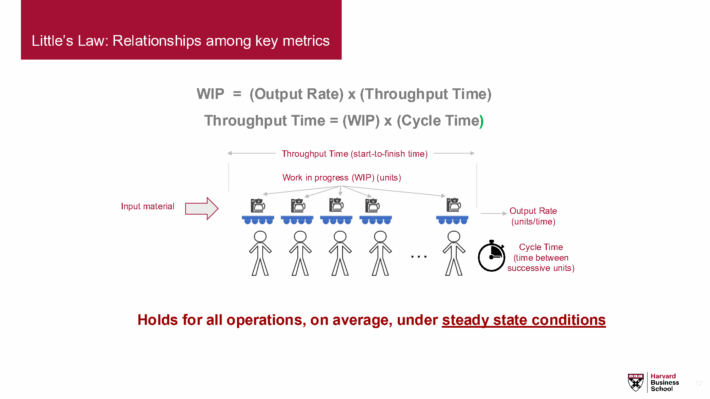
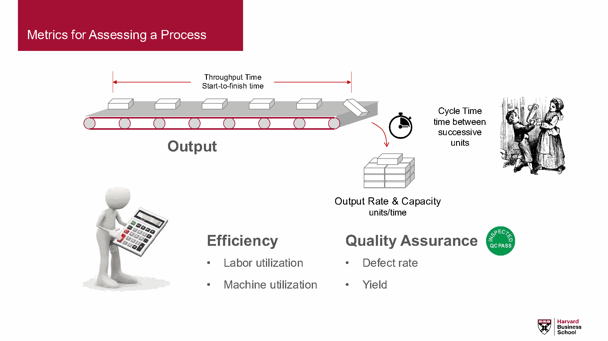
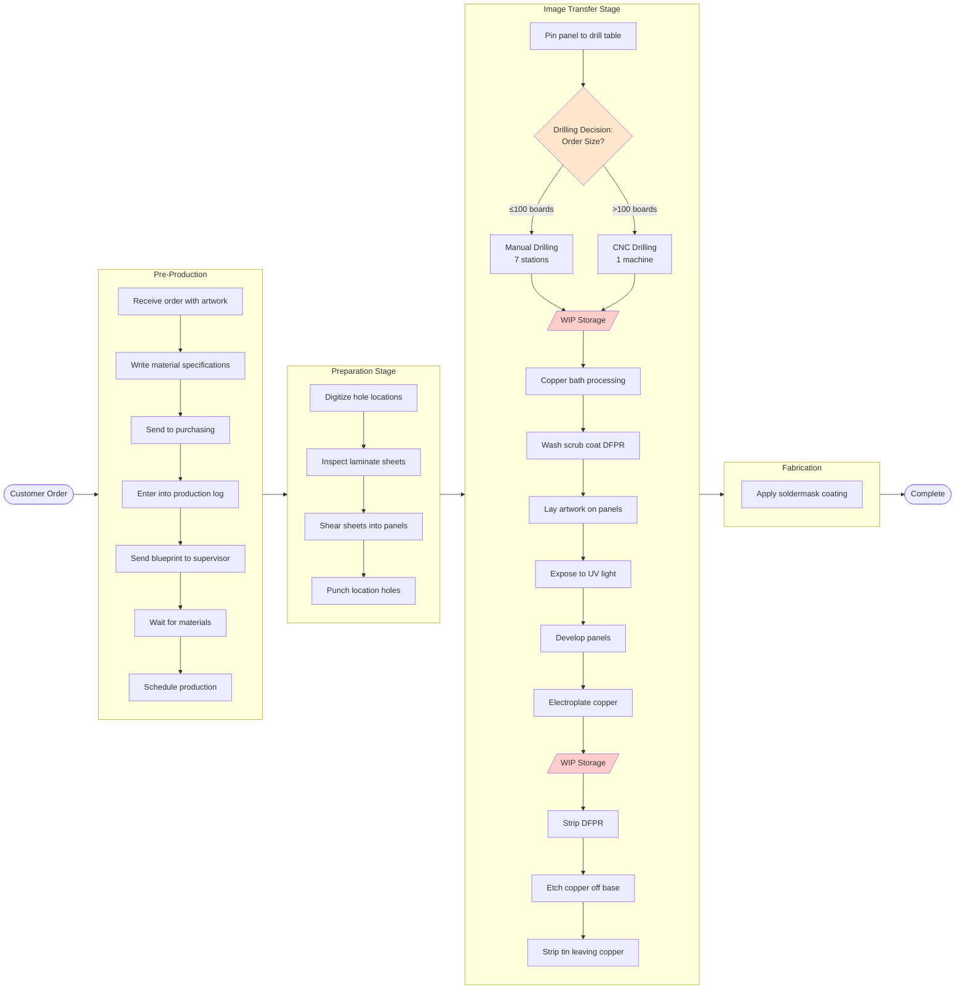
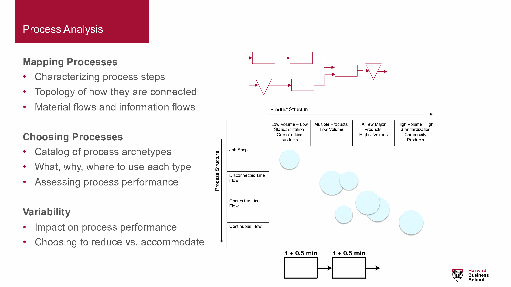
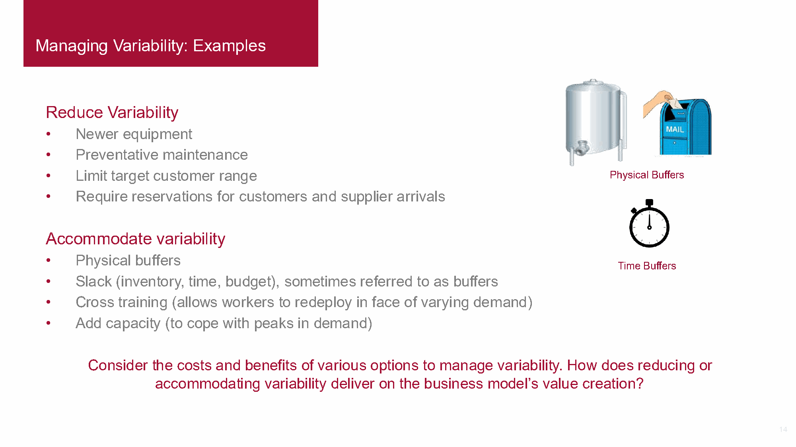
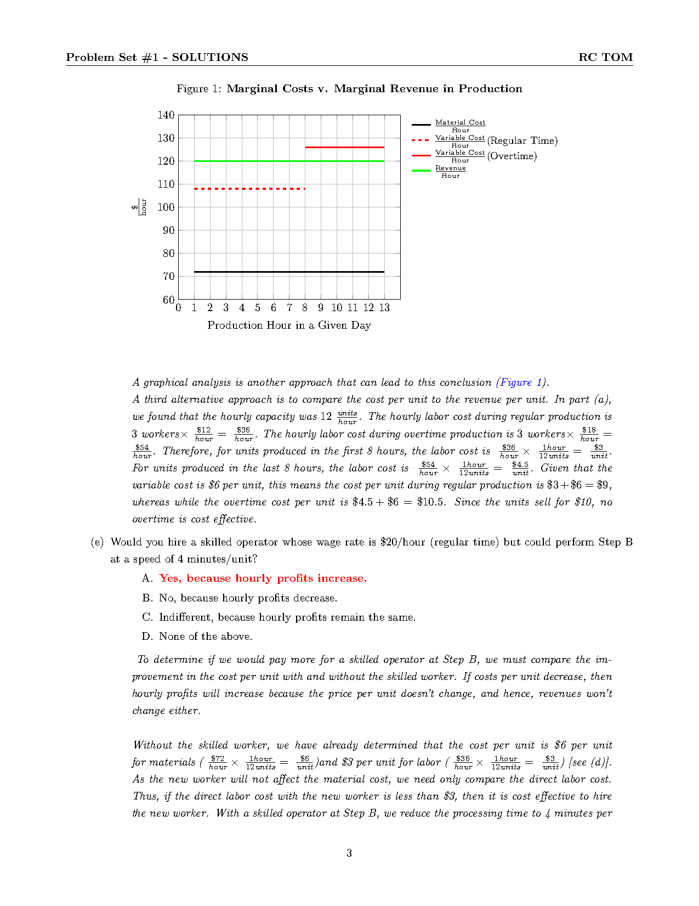
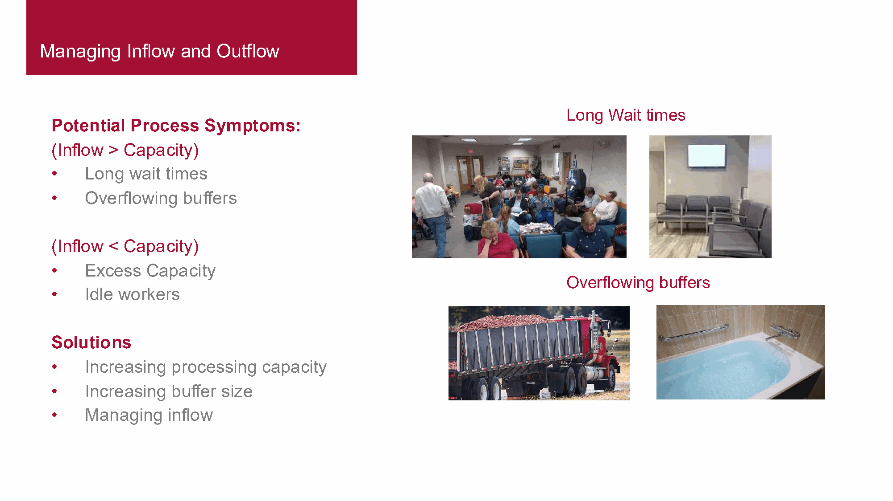
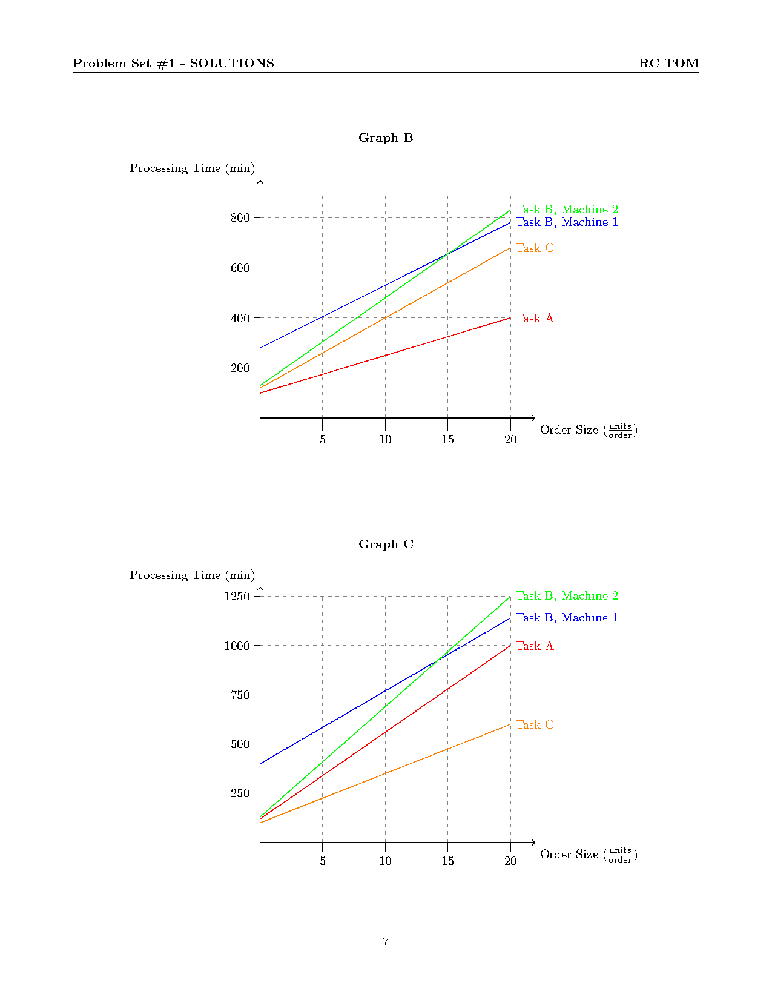
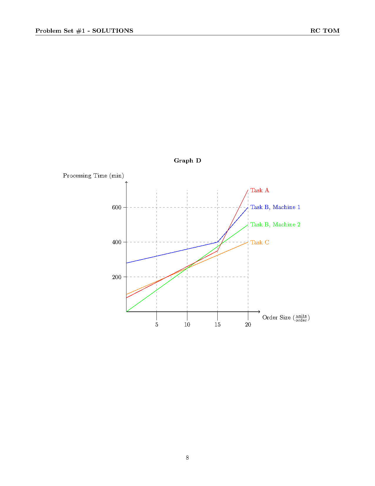

# TOM Midterm Study Guide
*Your Complete Exam Companion for October 16, 2025*

> **Exam Date**: Thursday, October 16, 2025
> **Time**: 1:30 – 5:00pm (3.5 hours + 15 min upload time)
> **Location**: Regular section classroom
> **Format**: Canvas, Multiple Choice, 35-40 questions
> **Coverage**: All materials up to and including Tessei case
> **Last Updated**: October 15, 2025

---

## 📑 **TABLE OF CONTENTS**

**I. EXAM ESSENTIALS**
- Exam Quick Facts - Logistics and rules
- During Exam: Problem Type Quick Reference - Immediate action guide
- Standard Exam Assumptions - 8 critical rules
- Essential Formulas - Little's Law, capacity, bottleneck
- Common Pitfalls to Avoid - Top 10 exam traps

**II. CORE FRAMEWORKS**
- Process Flow Visualization - Symbols and Donner flowchart
- Formula Selection Guide - Match problem to formula
- Sample Problems Library - 5 complete worked examples
- Key Concepts from Cases - Donner, NCC, Shad, Toyota, Tessei
- Cross-Case Patterns - 6 synthesis patterns

**III. ADVANCED STRATEGY**
- Marginal Points - 10 subtle distinctions for 95%+ performance
- TOM Vocabulary - Essential terms quick reference
- Core Principles - 14 fundamental concepts

**IV. EXAM DAY PREP**
- Study Strategy - Prioritized preparation
- Cheat Sheet Suggestions - What to include
- Day Before Checklist - Final preparations
- Quick Tips for Exam Day - Time management

---

## ⚡ EXAM QUICK FACTS

**TIMING & FORMAT**
- **Duration**: 3.5 hours working time (1:30-5:00pm) + 15 min upload (until 5:15pm)
- **Questions**: 35-40 multiple choice (~5-6 min per question)
- **Platform**: Canvas (https://canvas.hbs.edu/)
- **Weight**: 20% of total grade
- **Grading**: All questions weighted equally, no penalty for guessing

**WHAT YOU CAN BRING**
- ✅ One-page cheat sheet (8.5" x 11", double-sided, handwritten OR typed)
- ✅ Calculator (numeric/graphing OK, NO text functions, NO phone/tablet/laptop)
- ✅ Hardcopy dictionary (non-electronic)
- ✅ Laptop (ONLY for uploading answers after finishing)

**CRITICAL RULES**
- ❌ No communication during exam
- ❌ No internet except Canvas upload
- ❌ No generative AI tools
- ❌ Cannot change answers once laptop is opened
- ✅ Guess if unsure (no penalty!)
- ✅ Choose closest answer if exact not available

**SUPPORT**
- Content questions: Email professor AFTER exam (no questions during)
- Tech issues: 617-495-6600 (option 1)
- Urgent: cfongchew@hbs.edu

---

## 🎯 DURING EXAM: Problem Type Quick Reference

### If question asks "What is the bottleneck?"
→ **Quick Method**:
1. Calculate capacity of each step: Capacity = (# Resources × Time) / Processing Time
2. Find MINIMUM capacity = Bottleneck
3. System capacity = Bottleneck capacity

### If question asks "What is the throughput?"
→ **Remember**: System throughput = Bottleneck rate (ALWAYS!)
→ Ignore all other step capacities - they don't matter

### If question involves WIP, Flow Time, or Throughput Rate
→ **Use Little's Law**: WIP = Throughput Rate × Flow Time
→ Given any TWO, solve for the third
→ **Common trap**: Flow Time = WIP / Rate (NOT WIP × Cycle Time!)

### If question is about a conveyor belt
→ **Key insight**: Flow time is FIXED by belt speed
→ WIP = Throughput Rate × (Belt Length / Belt Speed)
→ Conveyor pace = bottleneck cycle time

### If question involves batches with setup times
→ **Formula**: Total Time = Setup Time + (Run Time per Unit × Batch Size)
→ **Watch for**: Bottleneck shifts with batch size
→ Setup dominates small batches, run time dominates large batches

### If question asks about variability/blocking/starving
→ **Check for overlap**: Do processing time ranges overlap with bottleneck?

**Quick Overlap Test Table**:

| Step Times | Overlap? | Effect | Actions That Help | Actions That DON'T Help |
|------------|----------|--------|-------------------|------------------------|
| A: 7, B: 8 | ❌ NO | Clear bottleneck (B) | Improve B | Train A, buffer anywhere |
| A: 7±2, B: 9±2 | ✅ YES | Blocking/starving | Train A or B, buffer between A&B | Only improving B |
| A: 7±2, B: 6±3, C: 4±2, D: 10±1 | Check D vs others | D likely bottleneck | Check if D overlaps with C | Improve A, B, or C if no overlap |

**Decision Rules**:
- **No overlap** → Predictable, OR = 1/CT bottleneck, buffer before bottleneck only
- **Overlap exists** → Unpredictable, OR < 1/CT, buffer between overlapping steps to decouple

### If question asks "Should we invest in improving Step X?"
→ **Decision tree**:
- Is X the current bottleneck? → YES, invest
- Will X become bottleneck after first improvement? → YES, invest
- Is X never a bottleneck at any volume/mix? → NO, don't invest
- Does X variability cause blocking/starving? → MAYBE, invest if impact significant

### If question asks "What happens when we ADD a new step to the process?"
→ **Systematic Analysis** (check ALL impacts):

**Step 1**: Identify new bottleneck location
- Calculate capacity of new step
- Compare with existing bottleneck
- New bottleneck = MIN(new step, old bottleneck)

**Step 2**: Analyze metric changes

| Metric | Impact of Adding Step | Why |
|--------|----------------------|-----|
| **Bottleneck** | May shift if new step < old bottleneck capacity | New step could become constraint |
| **System Capacity** | Decreases if new step is slower than old bottleneck | System = MIN capacity |
| **Output Rate (OR)** | Stays same if new step > old bottleneck<br/>Decreases if new step < old bottleneck | OR = bottleneck rate |
| **Direct Labor Content (DLC)** | ALWAYS increases | Adding work = more labor |
| **Throughput Time (TPT) - No WIP** | Increases by new step time | Serial path gets longer |
| **Avg TPT - With WIP** | Increases even more | Buffers add waiting time |

**Example**: Add step (25 min/3 units = 8.33 min/unit)
- Old bottleneck: 10 min/unit (6 units/hr)
- New step: 8.33 min/unit (7.2 units/hr)
- **Result**: Bottleneck stays at old step (slower), OR unchanged at 6 units/hr
- **But**: DLC increases by 25 min, TPT increases

**CRITICAL INSIGHT**: Just because new step is faster than current bottleneck doesn't mean it has NO impact:
- ✅ Output Rate: No change (correct)
- ❌ DLC: INCREASES (more total work)
- ❌ TPT: INCREASES (longer path + potential WIP)

### If question compares two processes (job shop vs. line flow)
→ **Breakeven analysis**: When does setup cost equal time savings?
→ **Example (Donner)**: Manual Time = CNC Setup + CNC Run Time

### If question asks about utilization
→ **Formula**: Utilization = Demand / Capacity
→ **Bottleneck utilization**: 100% (if demand ≥ capacity)
→ **Average utilization**: Total labor content / (# Workers × Cycle Time)

### If question involves time-varying input/output rates
→ **Track WIP over time**: WIP accumulates when input > output
→ **Maximum WIP**: Occurs at transition points (peak input or start of low input)
→ **Average WIP**: Calculate area under curve ÷ time period

---

## ⚠️ COMMON PITFALLS TO AVOID

**These exam traps catch even well-prepared students:**

### 1. Little's Law Direction Confusion
❌ **WRONG**: "Flow Time = WIP × Cycle Time"
✅ **RIGHT**: "Flow Time = WIP / Throughput Rate"

**Example trap**: 10 cars in system, 2 cars/hour throughput
- ❌ Wrong: 10 × 0.5 hr/car = 5 hours (backwards!)
- ✅ Right: 10 / 2 = 5 hours per car

### 2. System Throughput ≠ Average of Step Rates
❌ **WRONG**: "System throughput = average of all step capacities"
✅ **RIGHT**: "System throughput = bottleneck rate ONLY"

**Why it matters**: System always runs at pace of slowest step, NOT average!

### 3. Improving Non-Bottlenecks Wastes Money
❌ **WRONG**: "Improve the step with lowest utilization"
✅ **RIGHT**: "Improve current bottleneck or future bottleneck only"

**Trap**: Low utilization = plenty of capacity → improvement doesn't help system!

### 4. Buffer Placement Matters
❌ **WRONG**: "Place buffers anywhere to absorb variability"
✅ **RIGHT**: "Place buffers strategically based on variability and bottleneck location"

**Three Buffer Placement Rules:**

1. **Clear Bottleneck (No Overlap)**:
   - Place buffer RIGHT BEFORE bottleneck
   - Purpose: Protect bottleneck from upstream starvation
   - ❌ DON'T place after bottleneck (downstream never starves)

2. **Variability with Overlap**:
   - Place buffer BETWEEN overlapping steps to decouple the line
   - Purpose: Absorb variability, reduce blocking/starving
   - Example: If Steps 3 and 4 overlap, buffer between 3 & 4

3. **Conveyor-Paced Line**:
   - ❌ Cannot add buffers (WIP is fixed on belt)
   - WIP on belt IS the buffer

**Exam Decision Guide**: "Where should we place a buffer?"
1. Check for overlap → If YES, place between overlapping steps (decouple)
2. If NO overlap → Place before clear bottleneck (protect constraint)

### 5. Conveyor Belt Special Case
❌ **WRONG**: "WIP on conveyor depends on worker speed"
✅ **RIGHT**: "Flow time is FIXED by belt speed; WIP = Rate × Fixed Flow Time"

**Trap**: Even if bottleneck speeds up, conveyor flow time stays constant!

### 6. Batch Size Changes Bottleneck
❌ **WRONG**: "Bottleneck stays same regardless of batch size"
✅ **RIGHT**: "Bottleneck shifts: Small batches favor high setup, large batches favor high run time"

**Example (Fidget Spinner)**: Body is bottleneck at batch=30, Stickers at batch=70

### 7. Variability Reduces Capacity Even with Same Average
❌ **WRONG**: "If average times equal, throughput equal"
✅ **RIGHT**: "Higher variability = more blocking/starving = lower effective capacity"

**Example (Airport Security)**: Lines A and B have same 25-sec average, but A has higher variability → lower throughput

**CRITICAL DISTINCTION - Calculating Average Output Rate:**

| Scenario                                 | Can Calculate OR? | Formula                   | Why                                 |
| ---------------------------------------- | ----------------- | ------------------------- | ----------------------------------- |
| **Clear bottleneck (no overlap)**        | ✅ YES             | OR = 1 / CT of bottleneck | Predictable system pace             |
| **No clear bottleneck (overlap exists)** | ⚠️ DIFFICULT      | Cannot use simple formula | Blocking/starving makes OR variable |

**Example Comparison**:
- **Process A**: Steps with variability causing overlap → **Cannot easily calculate** average OR (unpredictable)
- **Process B**: Clear bottleneck (no overlap) → **OR = 1/CT** of bottleneck (predictable)
- **Result**: Average OR of A < Average OR of B (even if bottleneck averages are equal!)

**Exam Trap**: "Calculate the average output rate"
- ❌ WRONG: Always use 1/CT of bottleneck
- ✅ RIGHT: First check for overlap! If overlap exists, OR is lower than 1/CT

---

**[EXHIBIT 6 ALTERNATE: Variability and Throughput Relationship]**
*Could add visual showing how variability reduces throughput even with same averages*
*Optional exhibit location*

---

### 8. Utilization vs. Capacity Confusion
❌ **WRONG**: "High utilization means high capacity"
✅ **RIGHT**: "High utilization means demand is close to capacity (could be low capacity!)"

**Trap**: Bottleneck is 100% utilized, but that's the CONSTRAINT, not a strength!

### 9. Ignoring Standard Assumptions
❌ **WRONG**: "Account for startup time and defects"
✅ **RIGHT**: "Assume steady state, no defects, unlimited buffers UNLESS stated otherwise"

**Trap**: Over-complicating problems by adding factors not in assumptions!

### 10. Parallel Resources Capacity Calculation
❌ **WRONG**: "2 machines at 10 min/unit = 20 min capacity"
✅ **RIGHT**: "2 machines at 10 min/unit = 10 min / 2 = 5 min per unit = 12 units/hr"

**Formula**: Divide processing time by number of parallel resources

---

## 🔑 Standard Exam Assumptions

**MEMORIZE THESE - They apply to ALL questions unless stated otherwise:**

1. ✅ **Steady state** - Ignore start-up effects
2. ✅ **No variability** - Processing times constant, workers don't speed up/slow down
3. ✅ **No breakdowns** - Machines work perfectly, no maintenance needed
4. ✅ **Unlimited buffers** - Unless size specified, buffers can hold any WIP amount
5. ✅ **Zero travel time** - Transport between operations is instant
6. ✅ **100% yield** - No defective units produced
7. ✅ **Sufficient materials** - Initial operations never starved
8. ✅ **No batch splitting** - Batches stay together, complete one step before advancing

> **Remember**: These assumptions hold UNLESS the question explicitly states otherwise

---

## 📐 Essential Formulas for Cheat Sheet

### Little's Law (Most Important)
```
WIP = Throughput Rate × Flow Time
I = R × T

Rearranged:
- Flow Time (T) = WIP / Throughput Rate
- Throughput Rate (R) = WIP / Flow Time
```

**Common Mistake to Avoid**:
- ❌ WRONG: Flow Time = WIP × Cycle Time
- ✅ CORRECT: Flow Time = WIP / Throughput Rate

### Capacity & Bottleneck
```
Capacity = (# Resources × Time Available) / Processing Time per Unit

System Capacity = Minimum capacity across all steps (bottleneck)

Utilization = Demand / Capacity

System Throughput = Bottleneck Rate (always!)
```

### Cycle Time
```
Cycle Time = 1 / Throughput Rate
(Time between unit completions)
```

### Conveyor Belt WIP
```
WIP = Throughput Rate × (Belt Length / Belt Speed)

Note: Flow time is FIXED on conveyors
```

### Batch Processing
```
Batch Processing Time = Setup Time + (Processing Time per Unit × Batch Size)

Batch Cycle Time = Batch Processing Time / Batch Size
```

### Process Metrics Summary
| Metric | Formula | Units |
|--------|---------|-------|
| Flow Time (T) | WIP / Throughput Rate | Time |
| Throughput Rate (R) | Units / Time | Units/Time |
| WIP (I) | R × T | Units |
| Cycle Time | 1 / R | Time/Unit |
| Utilization | Demand / Capacity | % |

---

**[EXHIBIT 1: Little's Law Visual Diagram]**
*Source: Module 1 Wrap + Module 2 Intro 2025.pdf, Page 12*



---

**[EXHIBIT 5: Process Metrics Relationships]**
*Source: Module 1 Wrap + Module 2 Intro 2025.pdf, Page 6*



---

## 📊 FORMULA SELECTION GUIDE

**Match Your Problem Type to the Right Formula:**

| Problem Type | Key Indicators | Formula to Use | Watch Out For |
|-------------|----------------|----------------|---------------|
| **Bottleneck Identification** | Multiple process steps, different capacities | Capacity = (Resources × Time) / Process Time<br/>Bottleneck = MIN(all capacities) | System throughput = bottleneck rate ONLY |
| **Little's Law** | Given 2 of: WIP, Throughput, Flow Time | WIP = Rate × Time | ❌ Flow Time ≠ WIP × Cycle Time |
| **Conveyor Belt** | Moving belt, fixed speed, units on belt | WIP = Rate × (Length / Speed) | Flow time is FIXED by belt |
| **Batch Processing** | Setup time + run time per unit | Total = Setup + (Run × Batch Size) | Bottleneck shifts with batch size |
| **Parallel Resources** | Multiple machines doing same task | Effective Time = Time / # Resources | Divide time, not multiply |
| **Utilization** | How busy is a resource? | Utilization = Demand / Capacity | 100% = bottleneck (constraint!) |
| **Cycle Time** | Time between completions | Cycle Time = 1 / Throughput Rate | Bottleneck's cycle time paces system |
| **Flow Time** | Time in system for one unit | Flow Time = WIP / Throughput | Use Little's Law |
| **Labor Content** | Total work per unit | Sum all task times | Different from flow time! |
| **Line Balancing** | Distribute tasks among stations | Minimize max station time | Perfect balance = Labor / # Workers |
| **WIP Over Time** | Varying input/output rates | Track accumulation: Δ WIP = Input - Output | Max WIP at transition points |
| **Breakeven Analysis** | Choosing between processes | Set costs equal, solve for volume | Donner: Manual = CNC setup + run |

**Quick Decision Tree:**
```
START: What's given in the problem?

├─ Multiple steps with different times?
│  └─ → Find bottleneck (MIN capacity)
│
├─ WIP and Throughput Rate given?
│  └─ → Use Little's Law (I = R × T)
│
├─ Setup time + run time mentioned?
│  └─ → Batch processing formula
│
├─ Conveyor belt mentioned?
│  └─ → Fixed flow time formula
│
├─ Multiple machines doing same job?
│  └─ → Parallel resources (divide time)
│
└─ Time-varying rates?
   └─ → Track WIP accumulation over time
```

---

## 🔄 Process Flow Visualization

### Standard Process Flow Symbols

| Symbol | Description | Usage |
|--------|-------------|-------|
| **Rectangle □** | Task/Activity | Any value-adding operation |
| **Diamond ◊** | Decision Point | Where flow splits based on criteria |
| **Triangle ▽** | WIP/Inventory | Materials waiting between operations |
| **Circle ○** | Information Storage | Databases, records, control systems |
| **Arrow →** | Material Flow | Physical movement direction |
| **Dashed Arrow ⟶** | Information Flow | Data/instructions movement |

### Donner Company Complete Process Flow



**Key Process Characteristics**:
- **16 production steps** from digitizing through soldermask
- **Single decision point**: Manual vs CNC drilling based on order size
- **Two WIP accumulation points**: After drilling and electroplating
- **Completely serial flow**: No parallel paths except drilling resource choice
- **Breakeven**: ~500 holes (use CNC for orders >500 holes)

---

## 🎓 Key Concepts from Cases

### Donner Company (PCB Manufacturing)
**Main Question**: Job shop vs line flow - when to use manual vs CNC drilling?

**Key Calculation**:
```
Breakeven Analysis:
Manual Time = CNC Setup + CNC Run Time
0.5 min/hole × N holes = 240 min + 0.08 min/hole × N holes
Breakeven = 500 holes

- Orders > 500 holes → Use CNC (line flow)
- Orders < 500 holes → Use manual (job shop)
```

**Key Insights**:
- Setup time dominates for small orders
- Different processes optimal for different volumes
- Bottleneck shifts with product mix
- High setup = favor large batches

### National Cranberry Cooperative
**Main Question**: Where is the bottleneck during peak harvest?

**Capacity Analysis**:
- Receiving: 5 dumpers × 75 bbls/hr = 375 bbls/hr
- Drying: 3 dryers × 200 bbls/hr = 600 bbls/hr
- Separating: 3 lines × 400 bbls/hr = 1,200 bbls/hr
- **Bottleneck**: Receiving (lowest capacity)

**Key Insights**:
- Bottleneck depends on product mix (wet/dry berry ratio)
- Seasonal capacity planning challenges
- Multiple improvement options with different costs

### Shad Process Flow Design
**Main Question**: How to map and analyze process flows?

**Key Skills**:
- Draw process flow diagrams
- Identify parallel vs sequential operations
- Calculate flow time through different paths
- Find critical path (longest flow time)

### Toyota Motor Manufacturing
**Main Question**: How does Toyota achieve quality and efficiency?

**Toyota Production System (TPS) Principles**:
- **Jidoka** (Autonomation): Build quality in, stop on defects
- **Andon Cord**: Any worker can stop the line
- **Poka-Yoke**: Error-proofing devices
- **Just-in-Time**: Right part, right time, right quantity
- **Continuous Flow**: Minimize WIP and inventory

**Key Insight**: Quality at the source prevents downstream problems

### Trouble at Tessei
**Main Question**: How to achieve excellence through Kaizen?

**Kaizen Principles**:
- **Continuous improvement**: Small, incremental changes
- **Employee involvement**: Front-line workers drive improvement
- **Standardization**: Document best practices
- **Visual management**: Make problems visible

**7-Minute Turnaround**:
- Reduced cleaning time from 12 min to 7 min
- Increased pride and ownership
- Transformed "undesirable" work into respected craft

---

## 🔍 CROSS-CASE PATTERNS & INSIGHTS

### Pattern 1: Bottleneck Identification is KING

**Across ALL cases, finding the bottleneck is the first step:**

| Case | Bottleneck Location | Why It Matters |
|------|-------------------|----------------|
| **Donner Company** | Shifts with order size (Manual drilling for small, other steps for large) | Different processes optimal for different volumes |
| **National Cranberry** | Receiving during peak (375 bbls/hr vs 600+ at other steps) | Seasonal demand creates different constraints |
| **Edison Motors** | Station 2 (240 sec) initially, then Station 5 after rebalancing | Line balancing can shift bottleneck |
| **Airport Security Q** | ID Check (always bottleneck, no overlap) | Clear bottleneck = predictable throughput |
| **Airport Security R** | ID Check (bottleneck with overlap) | Overlap creates blocking/starving |
| **Sample Problems** | Varies (T-shirt sewing, Body creation, etc.) | Always find MIN capacity first! |

**Key Insight**: **If you can identify the bottleneck in ANY problem, you're 70% of the way to the answer!**

---

### Pattern 2: Process Type Determines Strategy

**Process Selection Matrix from Cases:**

| Process Type | Volume | Variety | Setup Time | Example from Cases | Key Trade-off |
|-------------|--------|---------|------------|------------------|---------------|
| **Job Shop** | Low | High | Matters less | Donner small orders (manual drilling) | Flexibility vs efficiency |
| **Batch** | Medium | Medium | CRITICAL | Fidget Spinner (setup dominates small batches) | Batch size optimization |
| **Line Flow** | High | Low | High but amortized | Donner large orders (CNC), Edison Motors | Efficiency vs flexibility |
| **Conveyor-Paced** | High | Very Low | N/A | Edison Motors assembly line | Fixed pace, line balancing critical |

**Decision Rule**:
- **High variety, low volume** → Job shop (flexible resources, general purpose equipment)
- **Medium variety/volume** → Batch (balance setup vs run time)
- **Low variety, high volume** → Line flow (dedicated resources, high efficiency)
- **Standardized product, very high volume** → Conveyor (fixed pace, maximize balance)

---

**[EXHIBIT 2: Process-Product Matrix Diagram]**
*Source: Module 1 Wrap + Module 2 Intro 2025.pdf, Page 5*



---

### Pattern 3: Variability Always Hurts

**Variability impact across cases:**

| Case | Source of Variability | Impact | Mitigation |
|------|---------------------|--------|------------|
| **National Cranberry** | Wet/dry berry ratio varies | Bottleneck location changes | Convert bins, add capacity |
| **Airport Security A** | ±5 sec at each step | Blocking/starving reduces throughput | Add buffers between steps |
| **Airport Security R** | Overlapping time ranges | Unpredictable bottleneck | Training to reduce variability |
| **Toyota/Tessei** | Process variation | Quality defects, inefficiency | Standardization, Jidoka, Kaizen |

**Key Principle**: **Even with identical averages, higher variability = lower throughput**

**Exam Pattern**: Look for questions comparing processes with same average times but different variability → Lower variability wins!

---

**[EXHIBIT 6: Managing Variability Examples]**
*Source: Module 1 Wrap + Module 2 Intro 2025.pdf, Page 14*



---

### Pattern 4: Investment Decisions Follow Same Logic

**Improvement investment framework (consistent across all cases):**

```
Should we invest in improving Step X?

├─ Is X the current bottleneck?
│  └─ YES → Invest! (increases system capacity)
│
├─ After improving current bottleneck, does X become the new bottleneck?
│  └─ YES → Invest! (prevents new constraint)
│
├─ Is X NEVER a bottleneck at any product mix/batch size?
│  └─ NO → Don't waste money! (no system impact)
│
└─ Does X's variability cause blocking/starving at bottleneck?
   └─ MAYBE → Invest only if quantifiable throughput impact
```

**Examples**:
- **NCC**: Invest in receiving (current bottleneck) or dryers (if wet berry % increases)
- **Fidget Spinner**: DON'T invest in bearings (never bottleneck at any batch size)
- **Edison Motors**: Invest in Station 2 (current) AND Station 5 (future after rebalancing)
- **Airport R**: Invest in training ID Check (reduces overlap blocking/starving)

---

**[EXHIBIT 3: Marginal Cost vs Revenue in Production]**
*Source: TOM Problem Set 1 (2025) - SOLUTIONS.pdf, Page 3*



---

### Pattern 5: Calculation Patterns Repeat

**Common calculation types across sample problems:**

| Calculation | Appears In | Formula | Common Trap |
|------------|-----------|---------|-------------|
| **System Capacity** | ALL problems | MIN(all step capacities) | ❌ Don't average! |
| **Flow Time (first unit)** | Stuffed Animal, Shad | Longest path through process | Include all serial steps |
| **Labor Content** | Stuffed Animal, Edison | Sum ALL task times | ≠ Flow time! |
| **Average Utilization** | Stuffed Animal, Edison | Labor / (Workers × Cycle Time) | Different from bottleneck util |
| **WIP on Conveyor** | Edison Motors | Rate × (Length / Speed) | Flow time is FIXED |
| **Max WIP over time** | Apple Picking | Find peak accumulation point | At transition from high→low input |
| **Average WIP over time** | Apple Picking | Area under curve ÷ time | Use geometry (triangles/rectangles) |
| **Batch total time** | Fidget Spinner | Setup + (Run × Size) | Divide by # parallel resources |
| **Breakeven volume** | Donner (implied) | Set alternatives equal | Solve for volume/batch size |

---

### Pattern 6: Common "Gotcha" Questions

**Questions that appear repeatedly in different disguises:**

1. **"Should we train Worker X?"**
   - ✅ YES if X is bottleneck or creates variability that blocks bottleneck
   - ❌ NO if X is non-bottleneck with plenty of capacity

2. **"Will adding a worker increase output?"**
   - ✅ YES if adding to bottleneck step
   - ❌ NO if adding to non-bottleneck (just increases idle time)

3. **"Which step should we NEVER upgrade?"**
   - → Find step that's never bottleneck at any scenario (Fidget Spinner: Bearings)

4. **"What happens to throughput if we speed up Step X?"**
   - ✅ Increases if X is bottleneck
   - ❌ No change if X is non-bottleneck

5. **"Compare Process A vs Process B - which has higher throughput?"**
   - → Find bottleneck in each, compare bottleneck rates
   - ❌ Don't be fooled by average step times!

6. **"What's the flow time through the system?"**
   - **Parallel paths**: Take LONGEST path
   - **Serial steps**: Sum all step times
   - **Conveyor**: Length / Speed (fixed!)
   - **Using Little's Law**: WIP / Throughput Rate

---

## 📊 Sample Problems Library

> **Note**: These are complete worked examples from official sample quiz materials. Practice these to understand exam question format and solution approach.

### Problem 1: Stuffed Animal Production (Parallel Process with Bottleneck)

**Scenario**: 8-station production line, no buffers, specialized workers

```
Process Flow:
Material → [Print wrapping] → [Add price tag] → Packaging
Prep ↘     1 min/toy         0.05 min/toy       0.5 min/toy
1 min/toy
            [Shape/sew body] → [Assemble toy] ↗
            3 min/toy           0.8 min/toy

            [Prepare fiber] ↗
            1.2 min/toy

            [Sew T-shirt] ↗
            4 min/toy
```

**Key Calculations**:

| Question | Calculation | Answer |
|----------|-------------|---------|
| **Flow time (first unit)** | Longest path: 1 + 4 + 0.8 + 0.5 = 6.3 min | **6.3 minutes** |
| **System capacity** | Bottleneck = Sew T-shirt (4 min/toy)<br/>= 1/4 toy/min × 60 min/hr | **15 toys/hour** |
| **Labor content** | Sum all task times:<br/>1 + 1 + 0.05 + 3 + 1.2 + 4 + 0.8 + 0.5 | **11.55 minutes** |
| **Highest utilization** | Bottleneck worker: 4/4 = 100% | **100%** |
| **Average utilization** | 11.55 min / (8 workers × 4 min) = 11.55/32 | **36%** |

**Key Insights**:
- System paced by slowest step (bottleneck)
- Bottleneck worker is 100% utilized
- Other workers have idle time
- Training should focus on bottleneck and next-slowest steps
- Reducing non-bottleneck times doesn't increase capacity

---

### Problem 2: Fidget Spinner Production (Batch Processing & Setup Times)

**Scenario**: 3-step batch process with setup and run times, no buffers

| Step | Setup Time | Run Time | Notes |
|------|------------|----------|-------|
| Create Body | 45 min/batch | 0.1 min/unit | 1 machine |
| Insert Bearings | 25 min/batch | 0.5 min/unit | 2 machines (parallel) |
| Add Stickers | 10 min/batch | 0.7 min/unit | 1 machine |

**Bottleneck Analysis for 30-unit batches**:

| Step | Total Time | Calculation | Bottleneck? |
|------|------------|-------------|-------------|
| Create Body | 48 min | 45 + (0.1 × 30) = 48 min | **YES (batch=30)** |
| Insert Bearings | 32.5 min | 25 + (0.5 × 30)/2 = 32.5 min | No |
| Add Stickers | 31 min | 10 + (0.7 × 30) = 31 min | No |

**Graphical Analysis**: **Bottleneck Shifts with Batch Size**

```
Processing Time vs. Batch Size

80│                                        Stickers
  │                                    ╱
70│                                 ╱
  │                              ╱
60│                           ╱
  │        Body           ╱
50│     ╱────────────  ╱
  │  ╱              ╱
40│╱            ╱
  │         ╱  Bearings
30│     ╱
  │  ╱
20│╱
  │
10│
  └────────────────────────────────────────────
   0   10   20   30   40   50   60   70   80
              Batch Size (units)

Intersection Points:
- Body = Stickers at 58.3 units → Bottleneck switches here
- Body = Bearings at 133.3 units
- Bearings NEVER the bottleneck (always middle line)
```

**Key Calculations**:
- **Labor content** (batch of 30): Setup times only = 45 + 25 + 25 + 10 = **105 minutes**
  - Note: Run time is automated (no labor)
- **Capacity with batch=30**: 1/(48 min/30 units) = **37.5 units/hour**
- **Which step to never upgrade**: Insert Bearings (never bottleneck at any batch size)

**Key Insights**:
- Bottleneck shifts based on batch size
- Setup time dominates for small batches
- Run time dominates for large batches
- Graph analysis reveals which step is NEVER the bottleneck
- Only invest in upgrading actual bottlenecks

---

### Problem 3: Edison Motors Assembly (Conveyor-Paced Line)

**Scenario**: 5-station conveyor assembly line, 19 tasks assigned to 5 workers

| Station | Tasks | Total Time | Details |
|---------|-------|------------|---------|
| Station 1 | 1-3 | 115 sec | 80 + 25 + 10 |
| Station 2 | 4-7 | **240 sec** | 70 + 75 + 80 + 15 (BOTTLENECK) |
| Station 3 | 8-11 | 155 sec | 50 + 15 + 45 + 45 |
| Station 4 | 12-15 | 130 sec | 35 + 30 + 35 + 30 |
| Station 5 | 16-19 | 200 sec | 15 + 5 + 65 + 115 |

**Key Calculations**:

| Question | Calculation | Answer |
|----------|-------------|---------|
| **Labor content** | Sum all task times | **840 seconds/car** |
| **Throughput time** | 5 stations × 240 sec/station<br/>OR: WIP × CT = 5 × 240 | **1,200 seconds** |
| **Capacity** | 60 min/hr ÷ 4 min/car | **15 cars/hour** |
| **Labor utilization** | 840 / (5 workers × 240 sec) = 840/1200 | **70%** |

**Line Balancing Exercise**:
- **Current bottleneck**: Station 2 (240 sec)
- **Best task reallocation**: Move Task 4 (70 sec) to Station 1
  - Station 1: 115 + 70 = 185 sec
  - Station 2: 240 - 70 = 170 sec
  - **New bottleneck**: Station 5 (200 sec)
  - **New capacity**: 60 min ÷ 3.33 min = **18 cars/hour** (20% improvement!)

**Key Insights**:
- Conveyor pace = bottleneck cycle time
- All stations must wait for slowest station
- WIP is fixed (one car per station = 5 cars)
- Balancing tasks reduces idle time
- Perfect balance: All stations equal time = 840/5 = 168 sec → 21.4 cars/hr capacity

---

### Problem 4: Airport Security (Variability & Blocking/Starving)

**Scenario**: 4-step security process, no buffers between steps

**Entry Line A vs B Comparison**:

| Step | Line A | Line B | Key Difference |
|------|--------|--------|----------------|
| Ticket/Gate | 25 ± 5 sec | 25 ± 3 sec | **Less variability in B** |
| ID Check | 25 ± 5 sec | 25 ± 3 sec | **Less variability in B** |
| Bag Inspection | 25 ± 5 sec | 25 ± 3 sec | **Less variability in B** |
| Pat Down | 25 ± 5 sec | 25 ± 3 sec | **Less variability in B** |

**Key Findings**:
- **Average time identical**: Both lines have 25 sec average at each step
- **Line B processes more passengers**: Less variability → less blocking/starving
- **Adding buffer to Line A**: Increases throughput by reducing blocking/starving
  - Increases labor utilization (less idle time)

**Terminal 2 Analysis (Entry Line Q vs R)**:

| Step | Line Q | Line R | Bottleneck Analysis |
|------|--------|--------|---------------------|
| Ticket/Gate | 20 ± 7 | 22 ± 11 | Range: 13-27 vs 11-33 |
| **ID Check** | **38 ± 7** | **38 ± 7** | **Range: 31-45 (CRITICAL)** |
| Bag Inspection | 27 ± 3 | 28 ± 4 | Range: 24-30 vs 24-32 |
| Pat Down | 15 ± 4 | 14 ± 3 | Range: 11-19 vs 11-17 |

**Line Q Analysis**:
- ID Check (31-45 sec) NEVER overlaps with other steps
- ID Check is ALWAYS bottleneck → avg cycle time = 38 sec
- **Training recommendation**: None (training non-bottleneck doesn't help)

**Line R Analysis**:
- ID Check (31-45 sec) OVERLAPS with:
  - Ticket/Gate (11-33 sec) → causes starving
  - Bag Inspection (24-32 sec) → causes blocking
- Overlap reduces throughput below 38 sec average
- **Training recommendation**: Train ID Check worker only
  - Eliminates variability → removes overlap → increases throughput

**Key Insights**:
- Variability reduces effective capacity
- Buffers mitigate blocking/starving
- No overlap in bottleneck times = predictable throughput
- Overlap in bottleneck times = reduced throughput
- Only train workers where variability causes overlap with bottleneck

---

### Problem 5: Apple Picking & Cider (WIP Accumulation Over Time)

**Scenario**: Workers deposit apples into bin, pressing machine processes at 100 kg/hr

**Daily Schedule**:
- 9am-12pm: 4 siblings × 50 kg/hr = 200 kg/hr input
- 12pm-1pm: No input (lunch break)
- 1pm-5pm: 1 sibling × 50 kg/hr = 50 kg/hr input
- After 5pm: Machine continues until bin empty

**WIP Accumulation Graph**:

```
Apples in Holding Bin (kg)

350│
   │            ╱╲
300│          ╱    ╲
   │        ╱        ╲
250│      ╱            ────╲
   │    ╱                    ╲
200│  ╱                        ╲
   │ ╱                          ╲
150│╱                            ╲
   │                              ╲
100│                               ╲
   │                                ╲
 50│
   │                                 ╲
  0└─────────────────────────────────╲
    9am  11am  1pm  3pm  5pm  7pm  9pm

Net accumulation rates:
- 9am-12pm: +100 kg/hr (200 in - 100 out)
- 12pm-1pm: -100 kg/hr (0 in - 100 out)
- 1pm-5pm: -50 kg/hr (50 in - 100 out)
- 5pm+: -100 kg/hr (0 in - 100 out)
```

**Key Calculations**:

| Question | Calculation | Answer |
|----------|-------------|---------|
| **Total processed/day** | Morning: 600 kg<br/>Afternoon: 200 kg | **800 kg** |
| **Max WIP** | At noon: 3 hr × 100 kg/hr | **300 kg** |
| **Avg WIP** | Total kg-hours / operating hours<br/>1,100 kg-hr / 8 hr | **137.5 kg** |
| **Avg time in bin** | Little's Law: WIP / Rate<br/>137.5 kg / 100 kg/hr | **1.375 hours** |
| **Shutdown time** | With 150 kg extra at 1pm:<br/>(350 kg at 1pm - 200 kg by 5pm) / 100 kg/hr | **6:30pm** |

**kg-hours Calculation** (area under curve):
- 9am-12pm triangle: ½ × 3 hr × 300 kg = 450 kg-hr
- 12pm-1pm: (1 hr × 200 kg) + (½ × 1 hr × 100 kg) = 250 kg-hr
- 1pm-5pm triangle: ½ × 4 hr × 200 kg = 400 kg-hr
- **Total**: 1,100 kg-hr ÷ 8 operating hours = 137.5 kg average

**Key Insights**:
- WIP accumulates when input > output
- WIP decreases when input < output
- Maximum WIP occurs at transition points
- Average WIP calculated as area under curve ÷ time
- Little's Law applies: Avg TPT = Avg WIP / Output Rate
- Adding workers increases total processed AND shutdown time

---

**[EXHIBIT 7: Inflow/Outflow Management Diagram]**
*Source: Module 1 Wrap + Module 2 Intro 2025.pdf, Page 15*



---

## 💎 MARGINAL POINTS - Subtle Distinctions

**These fine points separate 90% from 95%+ performance:**

### 1. Flow Time vs. Throughput Time vs. Cycle Time
**CRITICAL distinctions that get confused:**

- **Flow Time (Throughput Time)**: Time ONE unit spends in system (start to finish)
  - Example: Car enters at 1pm, exits at 1:20pm → Flow time = 20 minutes
- **Cycle Time**: Time BETWEEN unit completions (pace of output)
  - Example: Unit exits every 4 minutes → Cycle time = 4 min/unit
- **Relationship**: Flow Time = WIP × Cycle Time (for steady state) OR Flow Time = WIP / Throughput Rate

**Common exam trap**: "10 cars on belt, exits every 2 minutes, what's flow time?"
- ❌ WRONG: 10 × 2 = 20 minutes
- ✅ RIGHT: Depends on belt speed! If belt is 100m at 10m/min, flow time = 10 min (fixed by belt)

### 2. Labor Content ≠ Flow Time
**Two completely different concepts:**

- **Labor Content**: SUM of all task times (total work per unit)
  - Example: 8 workers, tasks = 1+1+0.05+3+1.2+4+0.8+0.5 = 11.55 min
- **Flow Time**: Time unit spends in system (longest path)
  - Example: Same system, longest path = 1+4+0.8+0.5 = 6.3 min

**Why different**: Workers work in parallel! Flow time = longest path, not sum of all paths.

### 3. Average Utilization Calculation Trap
**WRONG method** (seems logical but incorrect):
- ❌ "Average utilization = average of all individual utilizations"

**CORRECT method**:
- ✅ "Average utilization = Total Labor Content / (# Workers × Bottleneck Cycle Time)"
- Formula: Avg Util = (Sum of all task times) / (Workers × Cycle Time)

**Example**: 11.55 min labor / (8 workers × 4 min cycle) = 11.55/32 = 36%

### 4. Conveyor Belt Special Properties
**Conveyor ≠ Regular serial process:**

| Property | Regular Process | Conveyor Process |
|---------|----------------|------------------|
| Flow Time | Can vary with WIP | FIXED by belt speed |
| WIP | Varies with throughput | Also varies, but uses fixed flow time |
| Bottleneck impact | Sets throughput | Also sets throughput, but flow time unchanged |
| Buffer placement | Can add between steps | WIP IS the buffer (fixed on belt) |

**Exam trap**: "Bottleneck speeds up on conveyor belt, what happens to flow time?"
- ❌ WRONG: "Flow time decreases"
- ✅ RIGHT: "Flow time stays SAME (belt speed unchanged), throughput increases"

### 5. Parallel Resources Division (Not Multiplication!)
**Processing time with parallel resources:**

**WRONG approach**:
- ❌ "2 machines at 10 min/unit → Total capacity = 2 × 10 = 20 min"

**CORRECT approach**:
- ✅ "2 machines at 10 min/unit → Effective time = 10 / 2 = 5 min/unit"
- ✅ "Capacity = 60 min / 5 min/unit = 12 units/hour"

**Formula**: Effective Processing Time = Individual Time / # Parallel Resources

### 6. Batch Processing Bottleneck Shifts
**Not just which step is slowest, but which is slowest FOR THIS BATCH SIZE:**

**Example (Fidget Spinner)**:
- Create Body: 45 + 0.1×N minutes
- Add Stickers: 10 + 0.7×N minutes
- **Breakeven**: Set equal → 45 + 0.1N = 10 + 0.7N → N = 58.3 units

**Result**:
- Batches < 58 units → Body is bottleneck
- Batches > 58 units → Stickers is bottleneck
- Investment decision depends on typical batch size!

---

**[EXHIBIT 4: Bottleneck Shift Graph - Machine/Task Selection]**
*Source: TOM Problem Set 1 (2025) - SOLUTIONS.pdf, Pages 7-8*





---

### 7. Variability Overlap Test
**How to test if variability matters:**

**Step 1**: Calculate range for each step
- Example: ID Check = 38 ± 7 → Range: 31 to 45 seconds

**Step 2**: Compare ranges
- **No overlap**: Clear bottleneck (ID Check 31-45 vs Bag 24-30 → NO overlap)
  - Result: Predictable throughput = 38 sec average
- **Overlap exists**: Blocking/starving occurs (ID Check 31-45 vs Ticket 11-33 → OVERLAP at 31-33)
  - Result: Throughput < 38 sec average

**CRITICAL EXAM INSIGHTS - Overlap Decision Rules:**

| Scenario | Overlap? | Speeding Up Upstream Helps? | Buffer Helps? | Why |
|----------|----------|---------------------------|---------------|-----|
| **A: 7, B: 8** | ❌ NO | ❌ NO | ❌ NO | Clear bottleneck (B), no blocking/starving |
| **A: 7±2, B: 9±2** | ✅ YES (ranges 5-9 and 7-11) | ✅ YES | ✅ YES | Overlap causes variability issues |
| **A: 7±2, B: 6±3, C: 4±2, D: 10±1** | Check D vs others | Depends on overlap with D | Only if overlap exists | D is bottleneck (highest avg) |

**Decision Logic**:
1. **No overlap with bottleneck** → System has clear bottleneck
   - Output Rate = 1 / Cycle Time of bottleneck (predictable)
   - Speeding up non-bottleneck steps = NO impact
   - Buffers = NO help (bottleneck never starves)

2. **Overlap with bottleneck exists** → Blocking/starving occurs
   - Output Rate < 1 / Cycle Time of bottleneck (unpredictable)
   - Speeding up overlapping steps = INCREASES output rate
   - Buffers = YES, help decouple the line (place between overlapping steps)

**Exam pattern**:
- "Should we train Worker A?" → Check if A overlaps with bottleneck
- "Would buffer help?" → YES only if overlap exists
- "Compare Process 1 vs Process 2 throughput" → Check for overlap differences

### 8. WIP Accumulation Over Time
**When input rate ≠ output rate:**

**Key formulas**:
- **Instantaneous WIP change**: Δ WIP = Input Rate - Output Rate
- **Maximum WIP**: Occurs at transitions (end of high input period)
- **Average WIP**: Area under WIP curve ÷ Total time

**Common trap**: "What's average WIP?"
- ❌ WRONG: (Max WIP + Min WIP) / 2 (only works if linear!)
- ✅ RIGHT: Calculate area using geometry (triangles, rectangles)

**Example (Apple Picking)**:
- WIP graph creates triangles → Use ½ × base × height for each segment
- Total area = 450 + 250 + 400 = 1,100 kg-hours
- Average WIP = 1,100 / 8 hours = 137.5 kg

### 9. Investment "Never Worth It" Scenarios
**How to identify steps that should NEVER be upgraded:**

**Test across ALL scenarios**:
1. Graph processing time vs. batch size (or other variable)
2. Look for lines that NEVER cross at the lowest point
3. Those steps are never bottlenecks → Never invest

**Example (Fidget Spinner)**:
- Bearings line is always BETWEEN Body and Stickers
- Bearings never bottleneck at ANY batch size
- Investment in bearings = wasted money!

### 10. Line Balancing Perfect State
**Theoretical perfect balance:**

**Formula**: Perfect Cycle Time = Total Labor Content / # Workers
- Example: 840 sec labor / 5 workers = 168 sec per worker

**Reality check**:
- Can you assign tasks to achieve this exactly? (Usually no, due to task indivisibility)
- **Best achievable**: Minimize the maximum station time
- **Capacity with perfect balance**: # Workers / (Labor Content / 60 min)

**Exam trap**: "What's maximum possible capacity?"
- → Calculate perfect balance, even if task assignment doesn't allow it exactly

---

## 📚 TOM VOCABULARY - Quick Reference

**Essential terms and definitions for rapid review:**

| Term | Quick Definition | Formula (if applicable) | Common Usage |
|------|-----------------|------------------------|--------------|
| **Bottleneck** | Step with minimum capacity; paces entire system | Capacity = MIN(all steps) | "Find the bottleneck" |
| **WIP (Work-in-Process)** | Units currently in the system | WIP = Rate × Time | "How much WIP on the line?" |
| **Throughput Rate** | Units completed per time period | Rate = Units / Time | "What's system throughput?" |
| **Flow Time** | Time one unit spends in system (start to finish) | T = WIP / Rate | "How long in system?" |
| **Cycle Time** | Time between unit completions | CT = 1 / Rate | "Units exit every 4 minutes" |
| **Capacity** | Maximum rate a step can process | (Resources × Time) / Process Time | "What's the capacity?" |
| **Utilization** | % of capacity being used | Demand / Capacity | "How busy is this step?" |
| **Labor Content** | Total work time per unit (sum of all tasks) | Sum of all task times | Different from flow time! |
| **Little's Law** | Fundamental relationship: Inventory = Rate × Time | I = R × T | "Use Little's Law" |
| **Blocking** | Downstream step stops upstream (full buffer) | N/A | "Blocking reduces throughput" |
| **Starving** | Upstream can't feed downstream (empty buffer) | N/A | "Starving causes idle time" |
| **Buffer** | Storage between steps to absorb variability | N/A | "Place buffer before bottleneck" |
| **Batch Processing** | Process multiple units with one setup | Total = Setup + Run×Size | "What batch size?" |
| **Setup Time** | Time to prepare equipment (one-time per batch) | N/A | "45 min setup per batch" |
| **Run Time** | Processing time per individual unit | N/A | "0.1 min per unit" |
| **Parallel Resources** | Multiple machines/workers doing same task | Effective Time = Time / # | "2 machines in parallel" |
| **Serial Process** | Steps performed in sequence | N/A | "Must complete A before B" |
| **Parallel Process** | Independent paths that can happen simultaneously | N/A | "Tasks 3, 4, 5 in parallel" |
| **Conveyor-Paced** | Flow time fixed by belt speed | WIP = Rate × (Length/Speed) | "Units on conveyor belt" |
| **Line Balancing** | Distribute work evenly across workers/stations | Minimize max station time | "Balance the assembly line" |
| **Steady State** | System operating normally (not starting up) | N/A | Standard exam assumption |
| **Process Variability** | Variation in task completion times | N/A | "±5 sec variation" |
| **Jidoka** | Automation with human intelligence (stop on defect) | N/A | Toyota Production System |
| **Kaizen** | Continuous improvement philosophy | N/A | Incremental changes |
| **Poka-Yoke** | Error-proofing mechanisms | N/A | Prevent defects |
| **Andon Cord** | System allowing workers to stop production line | N/A | Quality at source |
| **7 Wastes (TIMWOOD)** | Transportation, Inventory, Motion, Waiting, Overproduction, Overprocessing, Defects | N/A | Lean manufacturing |

**Quick Relationship Reminders**:
- Flow Time = WIP / Throughput Rate (Little's Law rearranged)
- Cycle Time = 1 / Throughput Rate
- System Throughput = Bottleneck Rate (always!)
- Average Utilization = Labor Content / (Workers × Cycle Time)
- Perfect Balance Cycle Time = Labor Content / # Workers

---

## 🌟 CORE PRINCIPLES - Memorize These

**Fundamental truths that underlie ALL TOM problems:**

### Process Analysis Principles

1. **The Bottleneck is KING**
   - System throughput = Bottleneck rate (always!)
   - System pace = Bottleneck cycle time
   - Improving non-bottlenecks doesn't increase system capacity

2. **Little's Law is UNIVERSAL**
   - WIP = Throughput Rate × Flow Time
   - Applies to entire system or individual steps
   - Given any 2 variables, you can find the 3rd
   - CRITICAL: Flow Time = WIP / Rate (NOT WIP × Cycle Time!)

3. **Variability Kills Performance**
   - Higher variability → More blocking/starving → Lower throughput
   - Even with identical averages, lower variability wins
   - Buffers mitigate variability impact (place before bottleneck!)

4. **Process Type Follows Volume-Variety Trade-off**
   - High variety, low volume → Job shop (flexibility)
   - Medium variety, medium volume → Batch (balance)
   - Low variety, high volume → Line flow (efficiency)
   - Standard product, very high volume → Conveyor (fixed pace)

### Investment & Improvement Principles

5. **Only Improve Bottlenecks (Current or Future)**
   - Current bottleneck → Directly increases system capacity
   - Future bottleneck → Prevents new constraint after first improvement
   - Never a bottleneck → Waste of money (no system impact)

6. **Buffer Placement Matters**
   - ALWAYS place buffers RIGHT BEFORE bottlenecks
   - Buffers protect constraint from starvation
   - Buffers after bottleneck don't help (downstream never starves)

7. **Batch Size Optimization**
   - Small batches → Setup time dominates
   - Large batches → Run time dominates
   - Bottleneck can shift with batch size!
   - Find breakeven point where alternatives are equal

### Calculation Principles

8. **Capacity Calculation Rules**
   - Single resource: Capacity = Time Available / Processing Time
   - Parallel resources: Effective Time = Time / # Resources
   - System capacity = MIN(all step capacities) = Bottleneck capacity

9. **Time Distinctions**
   - Flow Time = time one unit spends in system (longest path)
   - Cycle Time = time between completions (1 / Throughput Rate)
   - Labor Content = sum of all task times (total work per unit)
   - These are THREE DIFFERENT things!

### Strategic Principles

10. **Continuous Improvement Philosophy (Kaizen)**
    - Small, incremental changes compound over time
    - Employee involvement crucial (front-line knows best)
    - Standardize current best practice, then improve
    - Visual management makes problems visible

11. **Quality at the Source (Jidoka)**
    - Build quality in, don't inspect it in
    - Anyone can stop the line (Andon cord)
    - Fix problems immediately, don't pass them downstream
    - Error-proofing (Poka-Yoke) prevents defects

12. **Just-in-Time Principle**
    - Right part, right time, right quantity
    - Minimize WIP and inventory
    - Pull system (downstream demand triggers upstream)

### Exam Strategy Principles

13. **Read Carefully and Identify Problem Type**
    - Multiple steps with times → Find bottleneck
    - Given 2 of WIP/Rate/Time → Use Little's Law
    - Setup + run time → Batch processing
    - Conveyor mentioned → Fixed flow time
    - Variability mentioned → Check for overlap

14. **When in Doubt, Draw It Out**
    - Sketch the process flow
    - Label capacities at each step
    - Calculate bottleneck
    - Apply formulas systematically

**Remember**: These principles apply to ALL TOM problems. Master them and you'll recognize patterns instantly!

---

## 📚 Study Strategy

### High Priority (Do First)
1. ✅ **Review all problem sets** - Focus on calculations you got wrong
2. ✅ **Complete sample quiz** - Time yourself, then review solutions
3. ✅ **Create cheat sheet** - Process of making it helps you memorize
4. ✅ **Memorize key formulas** - Little's Law, capacity, utilization
5. ✅ **Understand exam assumptions** - Know the 8 standard assumptions

### Medium Priority
1. ✅ **Review case notes** - Key insights and calculations from each case
2. ✅ **Study Process Fundamentals notes** - Core concepts
3. ✅ **Practice process mapping** - Draw flows quickly and accurately
4. ✅ **Attend TF review sessions** - Get clarification on confusing topics

### Nice to Have
1. ✅ **Study group practice** - Explain concepts to each other
2. ✅ **Office hours** - Ask specific questions you're stuck on
3. ✅ **Review lecture slides** - Reinforce main concepts

---

## 📝 Cheat Sheet Suggestions

### Side 1: Formulas
```
LITTLE'S LAW: I = R × T
- Flow Time = WIP / Throughput
- Throughput = WIP / Flow Time

CAPACITY: (Resources × Time) / Processing Time
Utilization = Demand / Capacity
Cycle Time = 1 / Throughput Rate

BOTTLENECK: Minimum capacity step
System Capacity = Bottleneck Capacity
System Throughput = Bottleneck Rate

CONVEYOR: WIP = Rate × (Length / Speed)
```

### Side 2: Key Concepts
- 8 Standard Assumptions
- Process types: Job Shop, Batch, Line, Continuous
- Volume-Variety relationship
- Buffer placement: RIGHT BEFORE bottlenecks
- TPS principles: Jidoka, Just-in-Time, Andon
- 7 Wastes (TIMWOOD)
- Kaizen principles

### Common Mistakes to Include
- ❌ Flow Time ≠ WIP × Cycle Time
- ✅ Flow Time = WIP / Throughput
- ✅ System pace = Bottleneck rate (always!)
- ✅ Buffers BEFORE bottlenecks (not after)

---

## ⚡ Quick Tips for Exam Day

### Time Management (3.5 hours for 35-40 questions)
- ~5-6 minutes per question average
- **Quick pass first**: Answer easy questions first
- **Mark hard questions**: Come back if time permits
- **Save 30 min** for review and final calculations
- **Don't get stuck**: Guess and move on if necessary

### Calculator Tips
- Bring spare batteries
- Know how to use it efficiently
- Practice common calculations beforehand
- Write intermediate steps on scratch paper

### Stress Management
- Take deep breaths if stressed
- Remember: All questions weighted equally
- No penalty for guessing - ALWAYS answer
- If unsure between two options, pick one and move on

### Upload Process
- Only open laptop AFTER completely done working
- Double-check all answers entered correctly
- Submit BEFORE 5:15pm deadline
- Stay calm if minor tech issues

---

## 🎯 Day Before Checklist

### Academic Prep
- [ ] Completed sample quiz with solutions
- [ ] Reviewed all problem set solutions
- [ ] Cheat sheet finalized (both sides)
- [ ] Formulas memorized
- [ ] Case calculations reviewed

### Logistics Prep
- [ ] Calculator tested with fresh batteries
- [ ] Laptop fully charged
- [ ] Canvas login verified
- [ ] Know your section classroom and seat
- [ ] Set alarm for early arrival

### Mental Prep
- [ ] Good night's sleep (8+ hours)
- [ ] Healthy breakfast planned
- [ ] Confident mindset - you've prepared well!

---

## 💡 Final Reminders

### During the Exam
1. **Read each question twice** - Make sure you understand what's being asked
2. **Draw it out** - Quick sketch of process helps visualize
3. **Check units** - Minutes vs hours, units vs units/time
4. **Trust the assumptions** - Use the 8 standard assumptions unless told otherwise
5. **Guess intelligently** - Eliminate obviously wrong answers first

### Key Success Factors
- **Know Little's Law cold** - Most tested concept
- **Find bottleneck quickly** - Determines system performance
- **Remember: Steady state** - System running at bottleneck pace
- **Buffers before bottlenecks** - Protect the constraint
- **Choose closest answer** - Don't overthink if not exact

### You've Got This!
You've done the cases, problem sets, and preparation. Trust your work and answer confidently. Remember:
- All questions equal weight
- No penalty for guessing
- Pick closest answer
- Stay calm and focused

**Good luck! 🍀**

---

*Last Updated: October 15, 2025*
*Based on: FA25 TOM Midterm Guidelines & Preparing for RCTOM Quiz documents*
