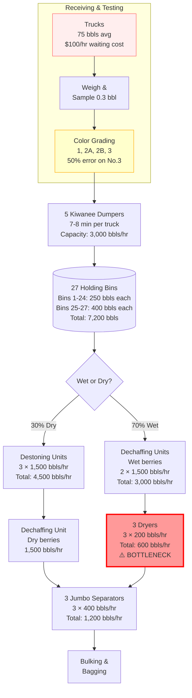

---
# Case Metadata
case_number: "9-688-122"
title: "National Cranberry Cooperative, 1996"
course: "TOM"
date_published: 1988
date_read: 2025-09-17
class_number: 5
professor: "Allison Mnookin"
tags: [case-study, operations-management, process-flow, capacity-analysis, bottleneck, agriculture, cooperatives]
industry: "Agricultural Processing"
company: "National Cranberry Cooperative"
geographic_focus: "United States"
key_topics: [process-flow-analysis, capacity-management, bottleneck-identification, overtime-costs, queuing-theory, wet-vs-dry-processing]
protagonists: ["Hugo Schaeffer", "Mel O'Brien", "Will Walliston"]
decision_point: "How to improve operations at RP1 before 1996 harvest"
teaching_objectives: [process-flow-mapping, capacity-calculation, bottleneck-analysis, cost-benefit-analysis]
---

# National Cranberry Cooperative, 1996

## Quick Facts
- **Case #**: 9-688-122
- **Course**: [[TOM]]
- **Date Read**: 2025-09-17
- **Industry**: Agricultural Processing
- **Geography**: United States

## Executive Summary
> National Cranberry Cooperative's Receiving Plant #1 faces severe operational challenges with excessive overtime costs and long truck waiting times during the 1995 harvest season. VP of Operations Hugo Schaeffer must identify and resolve bottlenecks in the cranberry processing system before the 1996 harvest, with wet-harvested berries increasing from 58% to an expected 70% of volume.

## Case Context

### Company Background
- National Cranberry Cooperative (NCC) is a grower-owned agricultural cooperative
- Processes and markets cranberries using continuous flow process
- One of the larger cooperatives with operations across North America (Massachusetts, New Jersey, Wisconsin, Washington, Oregon, British Columbia, Nova Scotia)
- 99% of all cranberry sales made through cooperatives
- Growers are the owners of the cooperative

### Industry Landscape
- Increasing mechanization of cranberry harvesting, especially water harvesting
- Water harvesting yields up to 20% greater than dry harvesting but causes damage and reduces storage time
- Significant oversupply problem leading to Agriculture Marketing Agreement Act implementation
- 1993: 87% of growers agreed to restrict new acreage development for 6 years
- 1995: 10% of crop set aside (destroyed or diverted) - over 200,000 barrels
- Price volatility: Average prices ranged from $21.54/barrel (1980-84) to $42.20/barrel (1994)

### Timeline of Events
- 1993: RP1 received 25,000 bbls of water-harvested fruit
- 1994: RP1 received 125,000 bbls of water-harvested fruit
- 1995: RP1 received 350,000 bbls of water-harvested fruit (58% of total)
- Winter 1995-96: $200,000 spent on fifth Kiwanee dumper
- February 14, 1996: Schaeffer initiates operations review
- 1996 forecast: 70% water-harvested berries expected

## Key Protagonists
- **Hugo Schaeffer**: Vice President of Operations
  - Background: Responsible for operations across all NCC plants
  - Key decisions: Must determine equipment investments and process improvements for RP1

- **Mel O'Brien**: Assistant to VP of Operations
  - Background: Tasked with analyzing RP1 operations
  - Key decisions: Must provide recommendations for capacity improvements

- **Will Walliston**: Superintendent of RP1
  - Background: Direct manager of plant operations
  - Key decisions: Advocates for new equipment purchases (dryers, bin conversions)

## Central Problem/Decision

### The Question
> What operational changes and capital investments should NCC make at RP1 to eliminate excessive overtime costs and truck waiting times while handling an increased percentage of wet-harvested berries?

### Constraints
1. 6-month lead time for equipment purchasing and installation
2. Processing season limited to ~4 months (September-December)
3. Union agreements limiting seasonal worker employment (Aug 15-Dec 25)
4. Maximum 22 hours/day operation (2 hours required for cleaning/maintenance)
5. Wet berries cannot be held overnight (must be processed same day)

### Success Metrics
- Reduce overtime costs (from excessive levels in 1995)
- Minimize truck waiting time (currently several hours)
- Reduce grower costs ($100/hour for truck and driver lease)
- Handle 70% wet berry mix efficiently

## Analysis

### Strengths
- Highly mechanized process with low downtime (< 8 hours for 350,000 bbls in 1995)
- Established infrastructure with multiple processing lines
- Strong grower ownership and commitment
- Premium pricing for high-quality (No. 3) berries ($1.50/bbl premium)

### Weaknesses
- Severe capacity bottleneck during peak season
- High overtime costs despite recent equipment investment
- Long truck waiting times causing grower dissatisfaction
- Poor color grading accuracy (only 50% of No. 3 premiums justified)
- Limited holding capacity for wet berries

### Opportunities
- Convert dry bins (1-16) to handle wet berries ($10,000 per bin)
- Add dryers to increase wet berry processing capacity ($60,000 each)
- Implement light meter system for accurate color grading ($40,000)
- Optimize scheduling with two-shift operation (7am-3pm, 3pm-11pm)

### Threats
- Increasing percentage of wet berries (58% to 70%) strains capacity
- Industry oversupply pressures margins
- Grower dissatisfaction with wait times could affect cooperative stability
- Competition from other cooperatives

## Financial Analysis
| Metric                    | Value               | Notes                         |
| ------------------------- | ------------------- | ----------------------------- |
| Truck lease cost          | $100/hour           | Major cost for growers        |
| Seasonal worker wage      | $8.00/hour          | Overtime at 1.5x              |
| Full-year employee wage   | $13.00/hour average | 27 permanent employees        |
| Fifth dumper cost         | $200,000            | Installed winter 1995-96      |
| Bin conversion cost       | $10,000/bin         | To convert dry to wet         |
| New dryer cost            | $60,000 each        | Three currently in operation  |
| Light meter system        | $40,000             | For color grading             |
| Premium for No. 3 berries | $1.50/barrel        | Paid on ~450,000 bbls in 1995 |

## Key Exhibits
- Exhibit 1: September 23, 1995 delivery log showing arrival patterns (18,340 bbls total, 42% wet)
- Exhibit 2: 1995 season deliveries showing daily volumes and wet/color mix percentages

## Discussion Questions
1. What are the most critical problems facing National Cranberry that Mr. Schaeffer must address?
2. Draw a process flow diagram for Receiving Plant #1 that extends through (and includes) the Jumbo Separator, and not the steps after that.
3. What is the capacity of each process step?
4. Estimate the cost of the trucks waiting to unload their berries for processing on a day where 18,000 barrels of berries arrive, of which 70% are wet.

## My Analysis & Recommendations

### Critical Problems Identified

1. **Wet Berry Processing Bottleneck**: The shift from 58% to 70% wet berries fundamentally changes operational dynamics. With only 600 bbls/hour drying capacity and 12,600 wet bbls daily requiring 21 hours of processing, the plant cannot handle volume within normal operating hours.

2. **Excessive Truck Waiting Costs**: Growers pay $100/hour for truck/driver lease yet wait several hours. This is an ownership issue—growers ARE the cooperative. The $200,000 spent on a fifth dumper exemplifies misdiagnosed solutions that worsen upstream queuing.

3. **Quality Grading Inaccuracy**: 50% error rate in No. 3 berry classification = $675,000 in unjustified premiums annually (450,000 bbls × $1.50 × 50% error), undermining pricing integrity.

### Process Flow Analysis

Key features:
- Bins 1-16: Dry berries only
- Bins 17-24: Wet or dry flexibility
- Bins 25-27: Wet berries only (400 bbls each)
- Total bin capacity: 7,200 bbls
- **Critical bottleneck**: Dryers at 600 bbls/hour (highlighted in red)

### Detailed Capacity Analysis

| Process Step | Configuration | Calculation | Total Capacity |
|-------------|--------------|-------------|----------------|
| **Truck Dumping** | 5 Kiwanee dumpers @ 7.5 min/truck | 5 × (60÷7.5) × 75 bbls | **3,000 bbls/hr** |
| **Holding Bins** | 24 bins @ 250 + 3 @ 400 bbls | Static storage | **7,200 bbls total** |
| **Destoning** (dry) | 3 units @ 1,500 bbls/hr | 3 × 1,500 | **4,500 bbls/hr** |
| **Dechaffing** | 3 units @ 1,500 bbls/hr | 3 × 1,500 | **4,500 bbls/hr** |
| **Drying** (wet) | 3 dryers @ 200 bbls/hr | 3 × 200 | **600 bbls/hr** ⚠️ |
| **Separators** | 3 lines @ 400 bbls/hr | 3 × 400 | **1,200 bbls/hr** |

**System Bottleneck**: Drying at 600 bbls/hour creates hard constraint backing up entire system

### Truck Waiting Cost Analysis

For 18,000 bbls/day with 70% wet:
- **Arrival rate**: 21.8 trucks/hour (240 trucks over 11 hours)
- **Wet berries arriving**: 1,145 bbls/hour
- **Processing capacity**: 600 bbls/hour
- **Deficit**: 545 bbls/hour accumulate

**Queue Buildup Timeline**:
- 8am: 545 bbls queued (7 trucks waiting)
- 12pm: 2,725 bbls queued (36 trucks waiting)
- 6pm: 5,995 bbls queued (80 trucks waiting)

**Cost Calculation**:
- Early trucks (25%): 2 hrs × 60 trucks × $100 = $12,000
- Mid-day trucks (50%): 5 hrs × 120 trucks × $100 = $60,000
- Late trucks (25%): 8 hrs × 60 trucks × $100 = $48,000
- **Total Daily Cost: $120,000**
- **Season Cost (60 days): $7.2 million**

### Recommended Action
> Immediately add two dryers ($120,000) to increase wet capacity to 1,000 bbls/hour, achieving 2-day ROI from truck waiting cost savings alone.

### Implementation Plan
1. **Immediate (for 1996 season)**:
   - Purchase 2 additional dryers ($120,000) → wet capacity to 1,000 bbls/hour
   - Convert bins 13-16 to wet/dry flexibility ($40,000)
   - Start processing at 3am (before truck arrivals)
   - Implement two-shift operation on peak days

2. **Medium-term**:
   - Install light meter system ($40,000) → save $337,500/year in grading errors
   - Develop truck appointment scheduling system
   - Train operators on optimal bin allocation strategies

3. **Long-term**:
   - Evaluate separator capacity if volumes exceed 20,000 bbls/day
   - Consider automated bin routing system
   - Negotiate staggered harvest schedules with growers

## Class Discussion Notes
> [To be filled during/after class discussion]

### My Participation
- **Times Spoken**: 0
- **Cold Called**: No

### Key Insights from Discussion
-

### Alternative Perspectives
-

### Professor's Takeaways
-

## Personal Reflections & Key Takeaways

### Synthesis of Learning
1. **Bottleneck identification drives operational improvements**: The drying capacity at 600 bbls/hour creates the primary constraint when 70% of 18,000 daily barrels (12,600 bbls) are wet, requiring 21 hours of drying time alone.

2. **System-wide thinking prevents sub-optimization**: Adding the fifth dumper didn't solve the problem because the bottleneck was downstream at the dryers - capacity must be balanced throughout.

3. **Seasonal operations require flexible capacity planning**: The mix shift from 58% to 70% wet berries fundamentally changes the capacity requirements, demonstrating how product mix affects operational design.

### Applications to Future Situations
- Always map the complete process flow before investing in capacity
- Calculate capacity at each step to identify true bottlenecks
- Consider product mix changes in capacity planning
- Evaluate both equipment and scheduling solutions

### Questions for Further Research
- What is the ROI period for the recommended dryer investment?
- How would implementing appointment scheduling for trucks affect the operation?
- Could the cooperative negotiate staggered harvesting schedules with growers?
- What are the quality implications of the different processing methods?

## Related Cases & Readings
- [[Benihana of Tokyo]] - process flow and capacity management
- [[The Goal by Goldratt]] - theory of constraints

## Additional Resources
- Video: Cranberry Processing (1:46) - shows similar facility operations
- Agriculture Marketing Agreement Act of 1937 - regulatory framework

---
*Original PDF*: [[9-688-122 National Cranberry Cooperative.pdf]]