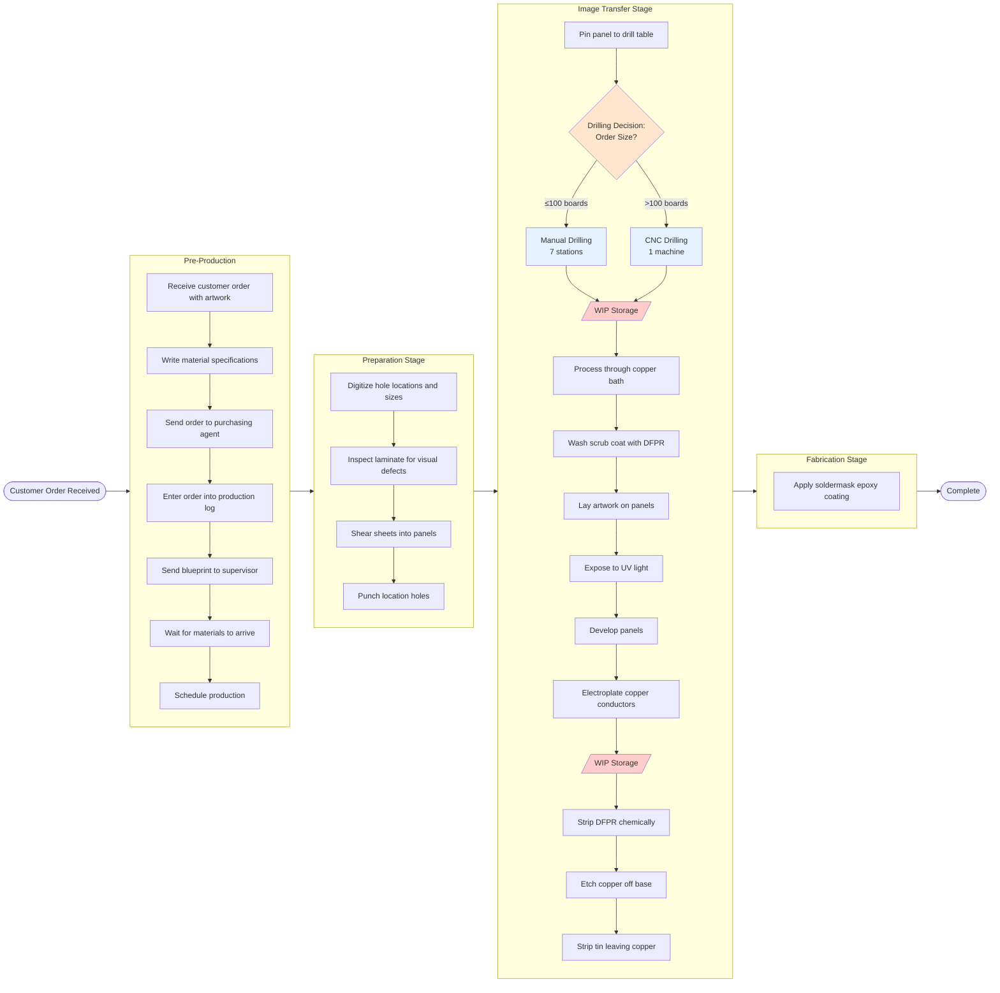

# Donner Company Process Flow - Horizontal (Left-Right) Flow

## Why Horizontal Flow Works Best

**Advantages:**
- Natural left-to-right reading pattern matches process progression
- Ideal for wide screens and presentations
- Shows time progression clearly
- Better for linear processes like Donner's production flow

## Key Process Insights

1. **Single Decision Point**: Only drilling has a resource choice (Manual vs CNC)
2. **Two Queue Points**: Natural WIP accumulation after drilling and electroplating
3. **Completely Serial**: No parallel paths except drilling resource choice
4. **16 Production Steps**: From digitizing through soldermask application

## Drilling Decision Analysis

### Breakeven Calculation
For drilling operation with ~500 holes per board:

**Manual Drilling (7 stations)**
- Setup: 15 minutes
- Run: 0.08 min/hole × 500 holes = 40 min/board
- Total for 100 boards: 15 + (40 × 100) = 4,015 minutes

**CNC Drilling (1 machine)**
- Setup: 240 minutes
- Run: 0.004 min/hole × 500 holes = 2 min/board
- Total for 100 boards: 240 + (2 × 100) = 440 minutes

**Breakeven Point**: ~6 boards
- Below 6 boards: Manual is faster
- Above 6 boards: CNC is faster
- At 100 boards: CNC is 9x faster!

---
*Source: Operations at the Donner Company (602-040)*
*Last Updated: 2025-09-09*