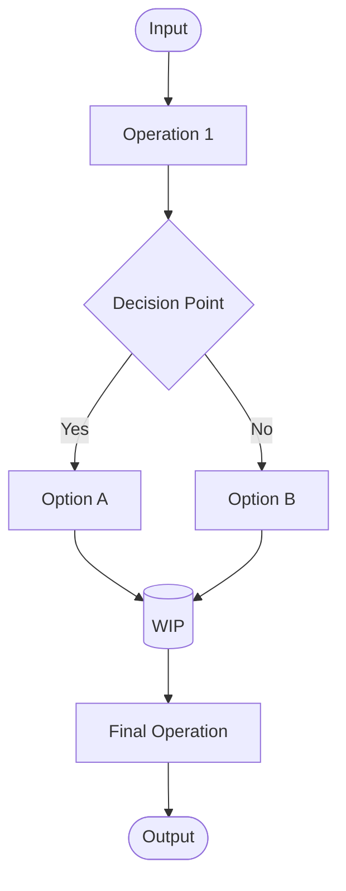
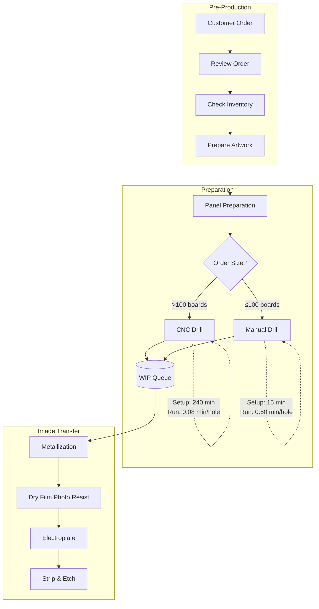
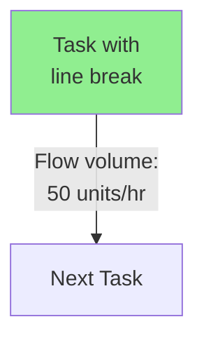
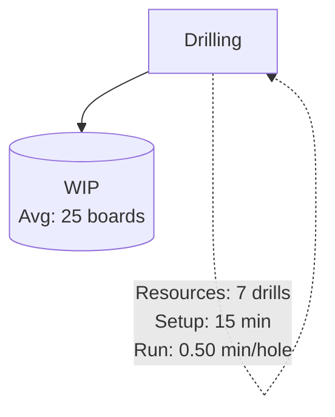
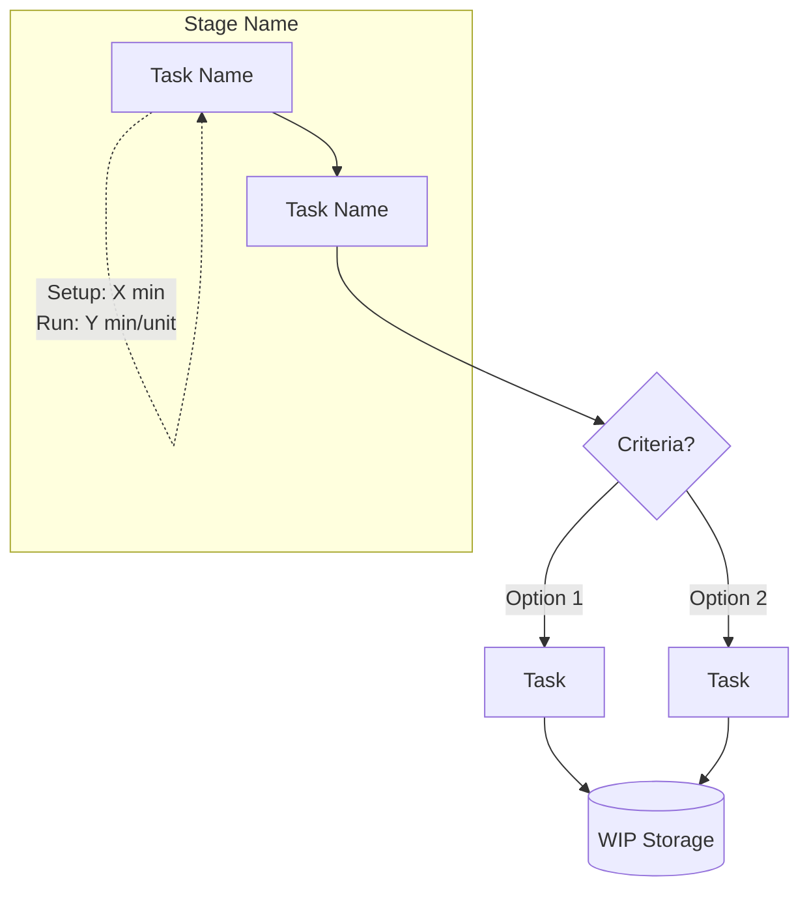

# Process Flow Diagramming Guide
*TOM Course Reference*

## Standard Process Flow Diagram Symbols

### Basic Elements

#### Tasks/Activities
- **Symbol**: Rectangle □
- **Usage**: Any value-adding activity or operation
- **Example**: Drilling, Electroplating, Packaging
- **Note**: Include operation name inside rectangle

#### Material/Product Flow
- **Symbol**: Solid arrow →
- **Usage**: Physical movement of materials, products, or customers
- **Direction**: Shows sequence and direction of flow
- **Example**: Panels moving from drilling to metallization

#### Information Flow
- **Symbol**: Dashed arrow ⟶
- **Usage**: Movement of data, instructions, or communications
- **Example**: Production orders, quality specifications, customer requirements
- **Note**: Often parallel to but separate from physical flow

### Storage & Inventory

#### Work-in-Process (WIP) / Inventory Storage
- **Symbol**: Inverted triangle ▽
- **Usage**: Any point where materials wait between operations
- **Location**: Between process steps where queuing occurs
- **Labels**: WIP, Raw Materials, Finished Goods Inventory (FGI)

#### Information Storage
- **Symbol**: Circle ○
- **Usage**: Databases, records, control systems
- **Example**: "Records & Control" for production orders
- **Note**: Less common than physical storage symbols

### Decision & Routing

#### Decision Points
- **Symbol**: Diamond ◊
- **Usage**: Where flow splits based on criteria
- **Example**: Manual vs CNC drilling decision at Donner
- **Labels**: Include decision criteria (e.g., "Order >100 boards?")
- **Outputs**: Label each path (Yes/No, Option A/B, etc.)

### Process Relationships

#### Serial Processing
- **Configuration**: Task → Task → Task
- **Meaning**: Operations must occur in sequence
- **Example**: Drill → Metallize → Electroplate

#### Parallel Processing (Independent)
- **Configuration**: Tasks side-by-side with separate flows
- **Meaning**: Operations can occur simultaneously
- **Example**: Two bread lines at bakery operating independently

#### Parallel Processing (Convergent)
- **Configuration**: Multiple paths that must rejoin
- **Meaning**: All parallel tasks must complete before continuing
- **Example**: Dough preparation AND filling preparation before assembly

### Additional Conventions

#### Process Boundaries
- **Symbol**: Dashed box around entire diagram
- **Usage**: Define scope of analysis
- **Label**: "Process Boundary" or system name

#### External Entities
- **Symbol**: Rectangle with double lines ╔═╗
- **Usage**: Customers, suppliers, other departments
- **Location**: Outside process boundaries

#### Resource Annotations
- **Format**: Text below or beside task rectangle
- **Include**: 
  - Number of resources (e.g., "7 drills")
  - Setup time
  - Run time per unit
  - Capacity constraints

#### Time Annotations
- **Format**: Small text near tasks or flows
- **Examples**:
  - Cycle time: "CT: 45 min"
  - Setup time: "Setup: 15 min"
  - Processing time: "Run: 0.08 min/hole"

## Best Practices

### Layout Guidelines
1. **Left to right** or **top to bottom** flow
2. **Minimize crossing lines** for clarity
3. **Group related operations** visually
4. **Use consistent spacing** between elements

### Labeling Standards
1. **Clear operation names** in rectangles
2. **Units of measure** for all times (min, hrs)
3. **Decision criteria** in diamonds
4. **Flow volumes** on arrows when relevant

### Color Coding (Optional)
- **Green**: Value-adding activities
- **Yellow**: Wait/storage/transport
- **Red**: Bottlenecks or problem areas
- **Blue**: Information/control flows

## Common Process Patterns

### Linear Flow
```
[Input] → [Task 1] → [Task 2] → [Task 3] → [Output]
```

### Flow with Decision
```
[Task] → ◊Decision◊ → [Option A]
            ↓
         [Option B]
```

### Parallel with Convergence
```
[Task 1] → [Task 2A] → [Task 3]
      ↘              ↗
        [Task 2B] →
```

### Flow with Storage
```
[Task 1] → ▽WIP▽ → [Task 2]
```

## Application to Donner Case

### Key Elements in Donner's Process
- **Decision diamond** at drilling (Manual vs CNC)
- **Rectangles** for each operation (15+ steps)
- **WIP triangles** between operations (especially before bottlenecks)
- **Annotations** for setup/run times from Exhibit 2
- **Single flow line** (completely serial except drilling choice)

## Quick Reference Checklist

Before submitting a process flow diagram:
- [ ] All operations shown as rectangles
- [ ] Flows clearly marked with arrows
- [ ] Decision points use diamonds
- [ ] Storage/WIP marked with triangles
- [ ] Times and capacities annotated
- [ ] Process boundaries defined
- [ ] Legend provided if using colors/special symbols

## Mermaid Translation Guide

### Converting TOM Symbols to Mermaid Syntax

Since Mermaid is available in Obsidian, here's how to translate traditional process flow symbols into Mermaid diagrams:

#### Symbol Mappings

| TOM Symbol | Description | Mermaid Syntax | Example |
|------------|-------------|----------------|---------|
| Rectangle □ | Task/Activity | `[Task Name]` | `[Drilling]` |
| Diamond ◊ | Decision Point | `{Decision?}` | `{Manual or CNC?}` |
| Inverted Triangle ▽ | WIP/Storage | `[(WIP Storage)]` or `[/WIP\]` | `[(WIP)]` |
| Circle ○ | Information Storage | `((Database))` | `((Records))` |
| Solid Arrow → | Material Flow | `-->` | `A --> B` |
| Dashed Arrow ⟶ | Information Flow | `-.->` | `A -.-> B` |
| Double Rectangle | External Entity | `[[Customer]]` | `[[Supplier]]` |

#### Basic Mermaid Structure



### Donner PCB Example in Mermaid



### Best Practices for Mermaid Process Flows

#### 1. Maintain TOM Conventions
- Use subgraphs to group process stages
- Keep decision labels clear (use criteria, not just Yes/No)
- Include time/capacity annotations using dotted lines

#### 2. Mermaid-Specific Tips


#### 3. Storage Symbol Workarounds
Since Mermaid lacks true inverted triangles:
- Use `[(Database shape)]` for storage (cylinder)
- Use `[/Trapezoid\]` for visual similarity
- Use `{{WIP}}` for hexagon alternative
- Add "WIP" or "Storage" text clearly

#### 4. Complex Annotations


### Quick Conversion Template

```markdown

```

### Validation Checklist for Mermaid Diagrams

- Graph direction specified (TD/LR)
- All tasks in rectangles `[Task]`
- Decisions in diamonds `{Decision?}`
- Storage clearly labeled with shape and text
- Subgraphs used for logical grouping
- Annotations include units (min, hrs, units)
- Flow labels on decision outputs
- Comments explain complex sections

---
*Based on Process Fundamentals (696-023) and TOM course materials*
*Last updated: 2025-09-09*