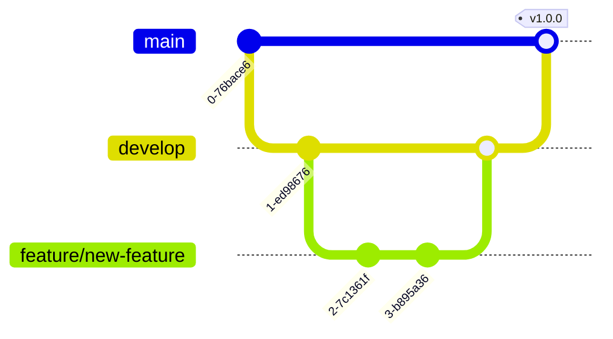

# Mermaid Diagram Templates

Copy any template below and modify for your needs!

## 1. Basic Decision Flow Template

## 2. Error Handling Template

## 3. API Sequence Template

## 4. State Machine Template

## 5. Gantt Chart Template

## 6. Mind Map Template

## 7. Entity Relationship Template

## 8. Git Flow Template

## 9. Pie Chart Template

## 10. Class Diagram Template

## Tips- Change `TD` to `LR` for Horizontal Flow

- Add emojis for visual appeal: 🚀 ✅ ❌ ⚠️ 
- Use subgraphs to group related nodes
- Color nodes with `style` or `class` definitions