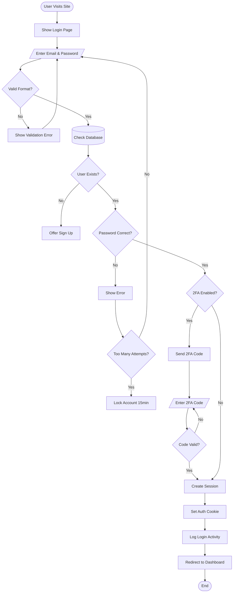
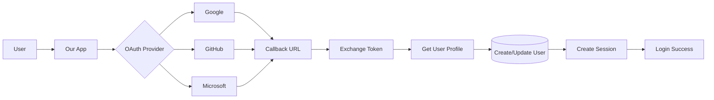

# User Login Flow

## Standard Login Process

```mermaid
flowchart TD
    Start([User Visits Site]) --> LoginPage[Show Login Page]
    LoginPage --> InputCreds[/Enter Email & Password/]
    InputCreds --> Validate{Valid Format?}
    
    Validate -->|No| ShowError[Show Validation Error]
    ShowError --> InputCreds
    
    Validate -->|Yes| CheckDB[(Check Database)]
    CheckDB --> UserExists{User Exists?}
    
    UserExists -->|No| CreateAccount[Offer Sign Up]
    UserExists -->|Yes| VerifyPass{Password Correct?}
    
    VerifyPass -->|No| WrongPass[Show Error]
    WrongPass --> AttemptsCheck{Too Many Attempts?}
    AttemptsCheck -->|Yes| LockAccount[Lock Account 15min]
    AttemptsCheck -->|No| InputCreds
    
    VerifyPass -->|Yes| Check2FA{2FA Enabled?}
    Check2FA -->|Yes| Send2FA[Send 2FA Code]
    Send2FA --> Enter2FA[/Enter 2FA Code/]
    Enter2FA --> Verify2FA{Code Valid?}
    Verify2FA -->|No| Enter2FA
    Verify2FA -->|Yes| CreateSession
    
    Check2FA -->|No| CreateSession[Create Session]
    CreateSession --> SetCookie[Set Auth Cookie]
    SetCookie --> LogActivity[Log Login Activity]
    LogActivity --> Dashboard[Redirect to Dashboard]
    Dashboard --> End([End])
```

## Oauth Login Flow

```mermaid
flowchart LR
    User[User] --> App[Our App]
    App --> OAuth{OAuth Provider}
    OAuth --> Google[Google]
    OAuth --> GitHub[GitHub]
    OAuth --> Microsoft[Microsoft]
    
    Google --> Callback[Callback URL]
    GitHub --> Callback
    Microsoft --> Callback
    
    Callback --> Token[Exchange Token]
    Token --> Profile[Get User Profile]
    Profile --> CreateUser[(Create/Update User)]
    CreateUser --> Session[Create Session]
    Session --> Success[Login Success]
```