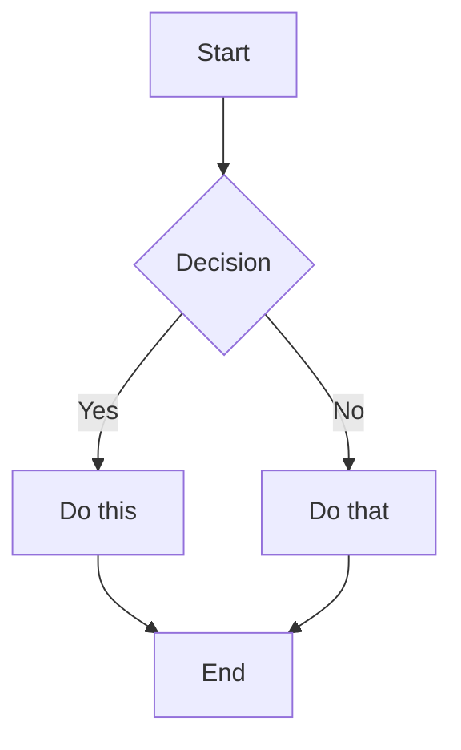

# Mermaid Displays Vault

Welcome to your Obsidian Mermaid diagram workspace! This vault is configured for creating and viewing Mermaid diagrams.

## Quick Start

1. **Create a new note** in Obsidian
2. **Add a code block** with `mermaid` language
3. **Switch to Reading View** (Ctrl+E) to see the rendered diagram

## Example Template

Copy this into any note:

## Vault Structure

- `/flowcharts` - Process and system flows
- `/architecture` - System architecture diagrams
- `/sequences` - API and interaction sequences
- `/mindmaps` - Brainstorming and idea maps
- `/templates` - Reusable diagram templates

## Tips

- Press `Ctrl+E` to toggle between Edit/Reading view
- Use `Ctrl+Click` on diagram elements to zoom
- Export diagrams: Right-click → "Export as image"